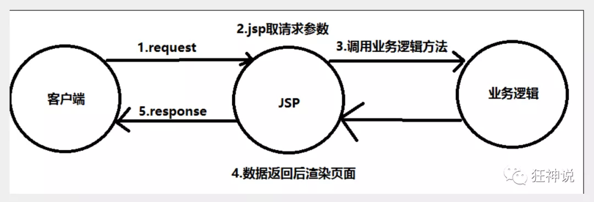
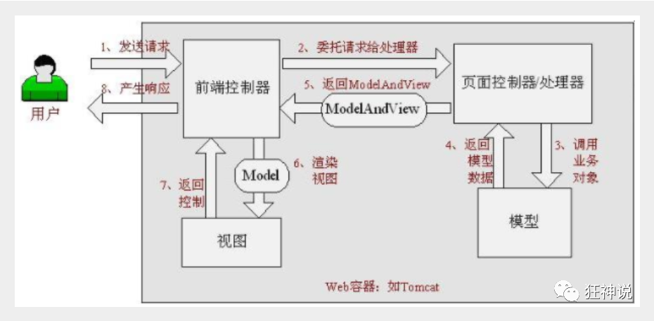
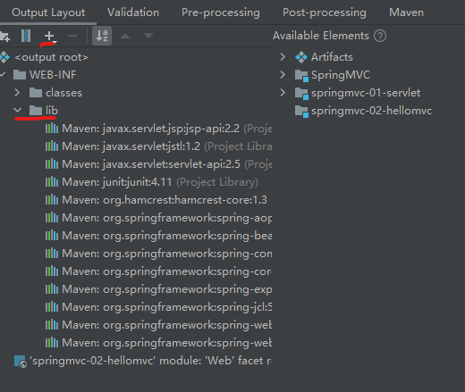

官方文档：https://docs.spring.io/spring-framework/docs/current/reference/html/web.html#spring-web

基于Spring实现的MVC轻量级Web框架

SSM: mybatis+Spring+SpringMVC

MVC三层架构

Java基础：认真学习，老师带，入门快

+ JavaSE

+ JavaWeb

框架：研究官方文档，锻炼官方文档，锻炼自学能力，锻炼笔记能力，锻炼项目能力

SpringMVC + Vue + SpringBoot + SpringCloud + Linux


SSM = JavaWeb项目

Sping: IOC和AOP

SpringMVC：SpringMVC的执行流程！

SpringMVC: SSM框架整合！


MVC：模型（dao, service）, 视图（jsp），控制器（Servlet）

## 1. 什么是SpringMVC

**1、回顾MVC**

### 1.1、什么是MVC

- MVC是模型(Model)、视图(View)、控制器(Controller)的简写，是一种软件设计规范。
- 是将业务逻辑、数据、显示分离的方法来组织代码。
- MVC主要作用是**降低了视图与业务逻辑间的双向偶合**。
- MVC不是一种设计模式，**MVC是一种架构模式**。当然不同的MVC存在差异。

**Model（模型）：**数据模型，提供要展示的数据，因此包含数据和行为，可以认为是领域模型或JavaBean组件（包含数据和行为），不过现在一般都分离开来：Value Object（数据Dao） 和 服务层（行为Service）。也就是模型提供了模型数据查询和模型数据的状态更新等功能，包括数据和业务。

**View（视图）：**负责进行模型的展示，一般就是我们见到的用户界面，客户想看到的东西。

**Controller（控制器）：**接收用户请求，委托给模型进行处理（状态改变），处理完毕后把返回的模型数据返回给视图，由视图负责展示。也就是说控制器做了个调度员的工作。

**最典型的MVC就是JSP + servlet + javabean的模式。**


### 1.2、Model1时代

- 在web早期的开发中，通常采用的都是Model1。
- Model1中，主要分为两层，视图层和模型层。



### 1.3、Model2时代

Model2把一个项目分成三部分，包括**视图、控制、模型。**


1. 用户发请求
2. Servlet接收请求数据，并调用对应的业务逻辑方法
3. 业务处理完毕，返回更新后的数据给servlet
4. servlet转向到JSP，由JSP来渲染页面
5. 响应给前端更新后的页面

**职责分析：**

**Controller：控制器**

1. 取得表单数据
2. 调用业务逻辑
3. 转向指定的页面

**Model：模型**

1. 业务逻辑
2. 保存数据的状态

**View：视图**

1. 显示页面

Model2这样不仅提高的代码的复用率与项目的扩展性，且大大降低了项目的维护成本。Model 1模式的实现比较简单，适用于快速开发小规模项目，Model1中JSP页面身兼View和Controller两种角色，将控制逻辑和表现逻辑混杂在一起，从而导致代码的重用性非常低，增加了应用的扩展性和维护的难度。Model2消除了Model1的缺点。


### 1.4、回顾Servlet

1. 新建一个Maven工程当做父工程！pom依赖！

```xml
<dependencies>
   <dependency>
       <groupId>junit</groupId>
       <artifactId>junit</artifactId>
       <version>4.12</version>
   </dependency>
   <dependency>
       <groupId>org.springframework</groupId>
       <artifactId>spring-webmvc</artifactId>
       <version>5.1.9.RELEASE</version>
   </dependency>
   <dependency>
       <groupId>javax.servlet</groupId>
       <artifactId>servlet-api</artifactId>
       <version>2.5</version>
   </dependency>
   <dependency>
       <groupId>javax.servlet.jsp</groupId>
       <artifactId>jsp-api</artifactId>
       <version>2.2</version>
   </dependency>
   <dependency>
       <groupId>javax.servlet</groupId>
       <artifactId>jstl</artifactId>
       <version>1.2</version>
   </dependency>
</dependencies>
```

2. 建立一个Moudle：springmvc-01-servlet ， 添加Web app的支持！
3. 导入servlet 和 jsp 的 jar 依赖

```xml
<dependency>
   <groupId>javax.servlet</groupId>
   <artifactId>servlet-api</artifactId>
   <version>2.5</version>
</dependency>
<dependency>
   <groupId>javax.servlet.jsp</groupId>
   <artifactId>jsp-api</artifactId>
   <version>2.2</version>
</dependency>
```

4. 编写一个Servlet类，用来处理用户的请求

```java
package com.ahulearn;

import javax.servlet.ServletException;
import javax.servlet.http.HttpServlet;
import javax.servlet.http.HttpServletRequest;
import javax.servlet.http.HttpServletResponse;
import java.io.IOException;

public class HelloServlet extends HttpServlet {
    @Override
    protected void doGet(HttpServletRequest req, HttpServletResponse resp) throws ServletException, IOException {
        //取得参数
        String method = req.getParameter("method");
        if (method.equals("add")){
            req.getSession().setAttribute("msg","执行了add方法");
        }
        if (method.equals("delete")){
            req.getSession().setAttribute("msg","执行了delete方法");
        }
        //调用业务层
        //视图请求转发或重定位向
        req.getRequestDispatcher("/WEB-INF/jsp/hello.jsp").forward(req,resp);
    }

    @Override
    protected void doPost(HttpServletRequest req, HttpServletResponse resp) throws ServletException, IOException {
        doGet(req,resp);
    }
}
```

5. 编写Hello.jsp，在WEB-INF目录下新建一个jsp的文件夹，新建hello.jsp

```xml
<%@ page contentType="text/html;charset=UTF-8" language="java" %>
<html>
<head>
   <title>Shenhuo</title>
</head>
<body>
${msg}
</body>
</html>
```

6. 在web.xml中注册Servlet

```xml
<?xml version="1.0" encoding="UTF-8"?>
<web-app xmlns="http://xmlns.jcp.org/xml/ns/javaee"
         xmlns:xsi="http://www.w3.org/2001/XMLSchema-instance"
         xsi:schemaLocation="http://xmlns.jcp.org/xml/ns/javaee http://xmlns.jcp.org/xml/ns/javaee/web-app_4_0.xsd"
         version="4.0">
    
    <servlet>
        <servlet-name>hello</servlet-name>
        <servlet-class>com.ahulearn.HelloServlet</servlet-class>
    </servlet>
    <servlet-mapping>
        <servlet-name>hello</servlet-name>
        <url-pattern>/hello</url-pattern>
    </servlet-mapping>
</web-app>
```

7. 配置Tomcat，并启动测试
   + localhost:8080/user?method=add
   + localhost:8080/user?method=delete

**MVC框架要做哪些事情**

1. 将url映射到java类或java类的方法 .
2. 封装用户提交的数据 .
3. 处理请求--调用相关的业务处理--封装响应数据 .
4. 将响应的数据进行渲染 . jsp / html 等表示层数据 .

**说明：**

​	常见的服务器端MVC框架有：Struts、Spring MVC、ASP.NET MVC、Zend Framework、JSF；常见前端MVC框架：vue、angularjs、react、backbone；由MVC演化出了另外一些模式如：MVP、MVVM 等等....


## 2. 什么是SpringMVC

### 2.1、概述


Spring MVC是Spring Framework的一部分，是基于Java实现MVC的轻量级Web框架。

查看官方文档：https://docs.spring.io/spring/docs/5.2.0.RELEASE/spring-framework-reference/web.html#spring-web

**我们为什么要学习SpringMVC呢?**

 Spring MVC的特点：

1. 轻量级，简单易学
2. 高效 , 基于请求响应的MVC框架
3. 与Spring兼容性好，无缝结合
4. 约定优于配置
5. 功能强大：RESTful、数据验证、格式化、本地化、主题等
6. 简洁灵活

Spring的web框架围绕**DispatcherServlet** [ 调度Servlet ] 设计。

DispatcherServlet的作用是将请求分发到不同的处理器。从Spring 2.5开始，使用Java 5或者以上版本的用户可以采用基于注解形式进行开发，十分简洁；

正因为SpringMVC好 , 简单 , 便捷 , 易学 , 天生和Spring无缝集成(使用SpringIoC和Aop) , 使用约定优于配置 . 能够进行简单的junit测试 . 支持Restful风格 .异常处理 , 本地化 , 国际化 , 数据验证 , 类型转换 , 拦截器 等等......所以我们要学习 .

**最重要的一点还是用的人多 , 使用的公司多 .** 


### 2.2、中心控制器

​	Spring的web框架围绕DispatcherServlet设计。DispatcherServlet的作用是将请求分发到不同的处理器。从Spring 2.5开始，使用Java 5或者以上版本的用户可以采用基于注解的controller声明方式。

​	Spring MVC框架像许多其他MVC框架一样, **以请求为驱动** , **围绕一个中心Servlet分派请求及提供其他功能**，**DispatcherServlet是一个实际的Servlet (它继承自HttpServlet 基类)**。


SpringMVC的原理如下图所示：

​	当发起请求时被前置的控制器拦截到请求，根据请求参数生成代理请求，找到请求对应的实际控制器，控制器处理请求，创建数据模型，访问数据库，将模型响应给中心控制器，控制器使用模型与视图渲染视图结果，将结果返回给中心控制器，再将结果返回给请求者。



### 2.3、SpringMVC执行原理


图为SpringMVC的一个较完整的流程图；实线：表示SpringMVC框架提供的技术，不需要开发者实现；虚线：表示需要开发者实现。

**简要分析执行流程**

1. DispatcherServlet表示前置控制器，是整个SpringMVC的控制中心。用户发出请求，DispatcherServlet接收请求并拦截请求。

   我们假设请求的url为 : http://localhost:8080/SpringMVC/hello

   

   **如上url拆分成三部分：**

   http://localhost:8080服务器域名

   SpringMVC部署在服务器上的web站点

   hello表示控制器

   通过分析，如上url表示为：请求位于服务器localhost:8080上的SpringMVC站点的hello控制器。

2. HandlerMapping为处理器映射。DispatcherServlet调用HandlerMapping,HandlerMapping根据请求url查找Handler。

3. HandlerExecution表示具体的Handler,其主要作用是根据url查找控制器，如上url被查找控制器为：hello。

4. HandlerExecution将解析后的信息传递给DispatcherServlet,如解析控制器映射等。

5. HandlerAdapter表示处理器适配器，其按照特定的规则去执行Handler。

6. Handler让具体的Controller执行。

7. Controller将具体的执行信息返回给HandlerAdapter,如ModelAndView。

8. HandlerAdapter将视图逻辑名或模型传递给DispatcherServlet。

9. DispatcherServlet调用视图解析器(ViewResolver)来解析HandlerAdapter传递的逻辑视图名。

10. 视图解析器将解析的逻辑视图名传给DispatcherServlet。

11. DispatcherServlet根据视图解析器解析的视图结果，调用具体的视图。

12. 最终视图呈现给用户。

在这里先听一遍原理，不理解没有关系，我们马上来写一个对应的代码实现大家就明白了，如果不明白，那就写10遍，没有笨人，只有懒人！


## 2 . 第一个MVC程序

IDEA shfit+shfit打开类搜索：

在上一节中，我们讲解了 什么是SpringMVC以及它的执行原理！

现在我们来看看如何快速使用SpringMVC编写我们的程序吧！

### 2.1 配置版

1、新建一个普通Moudle ， springmvc-02-hello ， 右键Add Framework support添加web的支持！

2、确定导入了SpringMVC 的依赖！

3、配置web.xml  ， 注册DispatcherServlet

```xml
<?xml version="1.0" encoding="UTF-8"?>
<web-app xmlns="http://xmlns.jcp.org/xml/ns/javaee"
         xmlns:xsi="http://www.w3.org/2001/XMLSchema-instance"
         xsi:schemaLocation="http://xmlns.jcp.org/xml/ns/javaee http://xmlns.jcp.org/xml/ns/javaee/web-app_4_0.xsd"
         version="4.0">
    <!--1.注册DispatcherServlet-->
    <servlet>
        <servlet-name>springmvc</servlet-name>
        <servlet-class>org.springframework.web.servlet.DispatcherServlet</servlet-class>
        <!--关联一个springmvc的配置文件:【servlet-name】-servlet.xml-->
        <init-param>
            <param-name>contextConfigLocation</param-name>
            <param-value>classpath:springmvc-servlet.xml</param-value>
        </init-param>
        <!--启动级别-1: 与服务器一起启动-->
        <load-on-startup>1</load-on-startup>
    </servlet>

    <!--/ 匹配所有的请求；（不包括.jsp）-->
    <!--/* 匹配所有的请求；（包括.jsp）-->
    <servlet-mapping>
        <servlet-name>springmvc</servlet-name>
        <url-pattern>/</url-pattern>
    </servlet-mapping>
</web-app>
```

4. 编写SpringMVC 的 配置文件！名称：springmvc-servlet.xml  : [servletname]-servlet.xml

说明，这里的名称要求是按照官方来的

```xml
<?xml version="1.0" encoding="UTF-8"?>
<beans xmlns="http://www.springframework.org/schema/beans"
      xmlns:xsi="http://www.w3.org/2001/XMLSchema-instance"
      xsi:schemaLocation="http://www.springframework.org/schema/beans
       http://www.springframework.org/schema/beans/spring-beans.xsd">

</beans>
```

5. 添加 处理映射器 可以不添加会使用默认的

```xml
<bean class="org.springframework.web.servlet.handler.BeanNameUrlHandlerMapping"/>
```

6. 添加 处理器适配器 可以不添加会使用默认的

```xml
<bean class="org.springframework.web.servlet.mvc.SimpleControllerHandlerAdapter"/>
```


7. 添加 视图解析器

```xml
<!--视图解析器:DispatcherServlet给他的ModelAndView,其他模板引擎 Thymeleaf Freemarker ...-->
<bean id="InternalResourceViewResolver" class="org.springframework.web.servlet.view.InternalResourceViewResolver">
   <!--前缀-->
   <property name="prefix" value="/WEB-INF/jsp/"/>
   <!--后缀-->
   <property name="suffix" value=".jsp"/>
</bean>
```

总的结构：

```xml
<?xml version="1.0" encoding="UTF-8"?>
<beans xmlns="http://www.springframework.org/schema/beans"
       xmlns:xsi="http://www.w3.org/2001/XMLSchema-instance"
       xsi:schemaLocation="http://www.springframework.org/schema/beans
       http://www.springframework.org/schema/beans/spring-beans.xsd">
	
    <!--处理映射器：根据bean名称映射，以后可以使用更强大的映射器-->
    <bean class="org.springframework.web.servlet.handler.BeanNameUrlHandlerMapping"/>
    <bean class="org.springframework.web.servlet.mvc.SimpleControllerHandlerAdapter"/>
    
    <!--视图解析器:DispatcherServlet给他的ModelAndView
	1. 获取ModeView的数据； 2. 解析ModelAndView的视图名字；
	3.拼接视图的名字，找到对应的视图；4. 将获取的数据渲染到获取的视图中
	-->
    <bean id="InternalResourceViewResolver" class="org.springframework.web.servlet.view.InternalResourceViewResolver">
        <!--前缀-->
        <property name="prefix" value="/WEB-INF/jsp/"/>
        <!--后缀-->
        <property name="suffix" value=".jsp"/>
    </bean>

    <!--Handler：BeanNameUrlHandlerMapping需要用到，配置地址与类的映射，相当于原来的mapping-->
    <bean id="/hello" class="com.ahulearn.controller.HelloController"/>
</beans>
```


8、编写我们要操作业务Controller ，要么实现Controller接口，要么增加注解；需要返回一个ModelAndView，装数据，封视图；

```java
package com.ahulearn.controller;

import org.springframework.web.servlet.ModelAndView;
import org.springframework.web.servlet.mvc.Controller;

import javax.servlet.http.HttpServletRequest;
import javax.servlet.http.HttpServletResponse;

//注意：这里我们先导入Controller接口
public class HelloController implements Controller {

    public ModelAndView handleRequest(HttpServletRequest request, HttpServletResponse response) throws Exception {
        //ModelAndView 模型和视图
        ModelAndView mv = new ModelAndView();

        //封装对象，放在ModelAndView中 Model
        mv.addObject("msg", "HelloSpringMVC!");
        
        //封装要跳转的视图，放在ModelAndView中
        // /WEB-INF/jsp/hello.jsp
        mv.setViewName("hello");
        return mv;
    }
}
```

9、将自己的类交给SpringIOC容器，注册bean

```xml
<!--Handler：配置了地址与类的映射，相当于原来的mapping-->
<bean id="/hello" class="com.ahulearn.controller.HelloController"/>
```

10、写要跳转的jsp页面，显示ModelandView存放的数据，以及我们的正常页面；

```jsp
<%@ page contentType="text/html;charset=UTF-8" language="java" %>
<html>
<head>
   <title>Shenhuo</title>
</head>
<body>
${msg}
</body>
</html>
```

11、配置Tomcat 启动测试！


### 问题：可能遇到的问题：访问出现404，排查步骤：

1. 查看控制台输出，看一下是不是缺少了什么jar包。
2. 如果jar包存在，显示无法输出，就在IDEA的项目发布中，添加lib依赖！
3. 重启Tomcat 即可解决

解决方法1：File->Project Structure->Project Settings->Artifacts->选择tomcat打包的的模块->右侧Output Layout->WEB-INF->新建lib文件夹，点击+号添加依赖



解决方法2：参考地址：[(2条消息) idea中的Maven项目没有lib的解决方案_佐月儿-CSDN博客_idea 没有lib](https://blog.csdn.net/CSDN_zuoyueer/article/details/103270227) 

​	不用新建lib文件夹，直接右键右侧的项目，选择Put into Output Root

使用maven-wabapp框架构建子项目不会有此问题

### 2.2 注解版

**1、新建一个Moudle，springmvc-03-hello-annotation 。添加web支持！**

2、由于Maven可能存在资源过滤的问题，我们将配置完善

```xml
<build>
   <resources>
       <resource>
           <directory>src/main/java</directory>
           <includes>
               <include>**/*.properties</include>
               <include>**/*.xml</include>
           </includes>
           <filtering>false</filtering>
       </resource>
       <resource>
           <directory>src/main/resources</directory>
           <includes>
               <include>**/*.properties</include>
               <include>**/*.xml</include>
           </includes>
           <filtering>false</filtering>
       </resource>
   </resources>
</build>
```

3、在pom.xml文件引入相关的依赖：主要有Spring框架核心库、Spring MVC、servlet , JSTL等。我们在父依赖中已经引入了！

**4、配置web.xml**

注意点：固定内容

```xml
<?xml version="1.0" encoding="UTF-8"?>
<web-app xmlns="http://xmlns.jcp.org/xml/ns/javaee"
        xmlns:xsi="http://www.w3.org/2001/XMLSchema-instance"
        xsi:schemaLocation="http://xmlns.jcp.org/xml/ns/javaee http://xmlns.jcp.org/xml/ns/javaee/web-app_4_0.xsd"
        version="4.0">

   <!--注册DispatchServlet-->
   <servlet>
       <servlet-name>SpringMVC</servlet-name>
       <servlet-class>org.springframework.web.servlet.DispatcherServlet</servlet-class>
       <!--通过初始化参数指定SpringMVC配置文件的位置，进行关联-->
       <init-param>
           <param-name>contextConfigLocation</param-name>
           <param-value>classpath:springmvc-servlet.xml</param-value>
       </init-param>
       <!-- 启动顺序，数字越小，启动越早 -->
       <load-on-startup>1</load-on-startup>
   </servlet>

   <!--所有请求都会被springmvc拦截 -->
   <servlet-mapping>
       <servlet-name>SpringMVC</servlet-name>
       <url-pattern>/</url-pattern>
   </servlet-mapping>

</web-app>
```

**/ 和 /\* 的区别：**< url-pattern > / </ url-pattern > 不会匹配到.jsp， 只针对我们编写的请求；即：.jsp 不会进入spring的 DispatcherServlet类 。< url-pattern > /* </ url-pattern > 会匹配 *.jsp，会出现返回 jsp视图 时再次进入spring的DispatcherServlet 类，导致找不到对应的controller所以报404错。

1. - 注意web.xml版本问题，要最新版！
   - 注册DispatcherServlet
   - 关联SpringMVC的配置文件
   - 启动级别为1
   - 映射路径为 / 【不要用/*，会404】


**5、添加Spring MVC配置文件**

在resource目录下添加springmvc-servlet.xml配置文件，配置的形式与Spring容器配置基本类似，为了支持基于注解的IOC，设置了自动扫描包的功能，具体配置信息如下：

```xml
<?xml version="1.0" encoding="UTF-8"?>
<beans xmlns="http://www.springframework.org/schema/beans"
       xmlns:xsi="http://www.w3.org/2001/XMLSchema-instance"
       xmlns:context="http://www.springframework.org/schema/context"
       xmlns:mvc="http://www.springframework.org/schema/mvc"
       xsi:schemaLocation="http://www.springframework.org/schema/beans
       http://www.springframework.org/schema/beans/spring-beans.xsd
       http://www.springframework.org/schema/context
       https://www.springframework.org/schema/context/spring-context.xsd
       http://www.springframework.org/schema/mvc
       https://www.springframework.org/schema/mvc/spring-mvc.xsd">

    <!-- 自动扫描包，让指定包下的自动装配注解生效,由IOC容器统一管理 -->
    <context:component-scan base-package="com.ahulearn.controller"/>
    <!-- 让Spring MVC不处理静态资源 .css .js .html .mp4 -->
    <mvc:default-servlet-handler />
    
    <!--
    支持mvc注解驱动
        在spring中一般采用@RequestMapping注解来完成映射关系
        要想使@RequestMapping注解生效
        必须向上下文中注册DefaultAnnotationHandlerMapping
        和一个AnnotationMethodHandlerAdapter实例
        这两个实例分别在类级别和方法级别处理。
        而annotation-driven配置帮助我们自动完成上述两个实例的注入。
     -->
    <mvc:annotation-driven />

    <!-- 视图解析器 : 模板引擎 ThymeLeaf Freemarker ... -->
    <bean class="org.springframework.web.servlet.view.InternalResourceViewResolver"
          id="internalResourceViewResolver">
        <!-- 前缀 -->
        <property name="prefix" value="/WEB-INF/jsp/" />
        <!-- 后缀 -->
        <property name="suffix" value=".jsp" />
    </bean>

</beans>
```

1. 在视图解析器中我们把所有的视图都存放在/WEB-INF/目录下，这样可以保证视图安全，因为这个目录下的文件，客户端不能直接访问。

2. - 让IOC的注解生效

   - 静态资源过滤 ：HTML . JS . CSS . 图片 ， 视频 .....

   - MVC的注解驱动

   - 配置视图解析器

     

3. **6、创建Controller**

4. 编写一个Java控制类：com.ahulearn.controller.HelloController , 注意编码规范

```java
package com.ahulearn.controller;

import org.springframework.ui.Model;
import org.springframework.web.bind.annotation.RequestMapping;
import org.springframework.stereotype.Controller;

@Controller
@RequestMapping("/HelloController")
public class HelloController {

    //真实访问地址 : 项目名/HelloController/hello
    @RequestMapping("/hello")
    public String sayHello(Model model){
        //向模型中添加属性msg与值，可以在JSP页面中取出并渲染
        model.addAttribute("msg","hello,SpringMVC");
        //web-inf/jsp/hello.jsp
        return "hello";
    }
}
```

1. - @Controller是为了让Spring IOC容器初始化时自动扫描到；
   - @RequestMapping是为了映射请求路径，这里因为类与方法上都有映射所以访问时应该是/HelloController/hello；
   - 方法中声明Model类型的参数是为了把Action中的数据带到视图中；
   - 方法返回的结果是视图的名称hello，加上配置文件中的前后缀变成WEB-INF/jsp/**hello**.jsp。

7、**创建视图层**

在WEB-INF/ jsp目录中创建hello.jsp ， 视图可以直接取出并展示从Controller带回的信息；

可以通过EL表示取出Model中存放的值，或者对象；

```jsp
<%@ page contentType="text/html;charset=UTF-8" language="java" %>
<html>
<head>
   <title>SpringMVC</title>
</head>
<body>
${msg}
</body>
</html>
```


#### 小结


实现步骤其实非常的简单：

1. 新建一个web项目
2. 导入相关jar包
3. 编写web.xml , 注册DispatcherServlet
4. 编写springmvc配置文件
5. 接下来就是去创建对应的控制类 , controller
6. 最后完善前端视图和controller之间的对应
7. 测试运行调试.


使用springMVC必须配置的三大件：

**处理器映射器、处理器适配器、视图解析器**

通常，我们只需要**手动配置视图解析器**，而**处理器映射器**和**处理器适配器**只需要开启**注解驱动**即可，而省去了大段的xml配置


##  3. Controller配置

### 控制器Controller

- 控制器复杂提供访问应用程序的行为，通常通过接口定义或注解定义两种方法实现。

- 控制器负责解析用户的请求并将其转换为一个模型。

- 在Spring MVC中一个控制器类可以包含多个方法

- 在Spring MVC中，对于Controller的配置方式有很多种

  

### 实现Controller接口

Controller是一个接口，在org.springframework.web.servlet.mvc包下，接口中只有一个方法；

```java
//实现该接口的类获得控制器功能
public interface Controller {
   //处理请求且返回一个模型与视图对象
   ModelAndView handleRequest(HttpServletRequest var1, HttpServletResponse var2) throws Exception;
}
```

只要实现了Controller接口的类，说明这就是一个控制器

**测试**

1. 新建一个Moudle，springmvc-04-controller 。

2. 配置web.xml

   ```xml
   <?xml version="1.0" encoding="UTF-8"?>
   
   <web-app xmlns="http://xmlns.jcp.org/xml/ns/javaee"
            xmlns:xsi="http://www.w3.org/2001/XMLSchema-instance"
            xsi:schemaLocation="http://xmlns.jcp.org/xml/ns/javaee http://xmlns.jcp.org/xml/ns/javaee/web-app_4_0.xsd"
            version="4.0">
   
     <!--注册DispatchServlet-->
     <servlet>
       <servlet-name>springmvc</servlet-name>
       <servlet-class>org.springframework.web.servlet.DispatcherServlet</servlet-class>
       <!--通过初始化参数指定SpringMVC配置文件的位置，进行关联-->
       <init-param>
         <param-name>contextConfigLocation</param-name>
         <param-value>classpath:springmvc-servlet.xml</param-value>
       </init-param>
       <!-- 启动顺序，数字越小，启动越早 -->
       <load-on-startup>1</load-on-startup>
     </servlet>
     <servlet-mapping>
       <servlet-name>springmvc</servlet-name>
       <url-pattern>/</url-pattern>
     </servlet-mapping>
   
   </web-app>
   ```

   

3. 配置beans文件：springmvc-servlet.xml

   ```xml
   <?xml version="1.0" encoding="UTF-8"?>
   <beans xmlns="http://www.springframework.org/schema/beans"
          xmlns:xsi="http://www.w3.org/2001/XMLSchema-instance"
          xmlns:context="http://www.springframework.org/schema/context"
          xmlns:mvc="http://www.springframework.org/schema/mvc"
          xsi:schemaLocation="http://www.springframework.org/schema/beans
          http://www.springframework.org/schema/beans/spring-beans.xsd
          http://www.springframework.org/schema/context
          https://www.springframework.org/schema/context/spring-context.xsd
          http://www.springframework.org/schema/mvc
          https://www.springframework.org/schema/mvc/spring-mvc.xsd">
   	
       <!-- 接口方式下方内容不需要添加 -->
       <!--自动装配扫描地址-->
       <context:component-scan base-package="com.ahulearn.controller"/>
       <!-- 静态资源过滤 -->
       <mvc:default-servlet-handler />
       <!-- 开启mvc注解驱动 -->
       <mvc:annotation-driven />
       <!-- 接口方式上方内容不需要添加 -->
   
       <!-- 视图解析器 : 模板引擎 ThymeLeaf Freemarker ... -->
       <bean class="org.springframework.web.servlet.view.InternalResourceViewResolver"
             id="internalResourceViewResolver">
           <!-- 前缀 -->
           <property name="prefix" value="/WEB-INF/jsp/" />
           <!-- 后缀 -->
           <property name="suffix" value=".jsp" />
       </bean>
       <bean name="/t1" class="com.ahulearn.controller.ControllerTest"/>
   </beans>
   ```

   

4. 编写一个Controller类，ControllerTest

   ```java
   package com.ahulearn.controller;
   
   import org.springframework.web.servlet.ModelAndView;
   import org.springframework.web.servlet.mvc.Controller;
   
   import javax.servlet.http.HttpServletRequest;
   import javax.servlet.http.HttpServletResponse;
   
   //定义控制器
   //注意点：不要导错包，导入的是Controller接口，重写方法；
   public class ControllerTest implements Controller {
   
       @Override
       public ModelAndView handleRequest(HttpServletRequest httpServletRequest, HttpServletResponse httpServletResponse) throws Exception {
           //返回一个模型视图对象
           ModelAndView mv = new ModelAndView();
           mv.addObject("msg","Test1Controller");
           mv.setViewName("test");
           return mv;
       }
   }
   ```

   

5. 编写完毕后，去Spring配置文件中注册请求的bean；name对应请求路径，class对应处理请求的类

```xml
<bean name="/t1" class="com.ahulearn.controller.ControllerTest"/>
```

6. 编写前端test.jsp，注意在WEB-INF/jsp目录下编写，对应我们的视图解析器

```jsp
<%@ page contentType="text/html;charset=UTF-8" language="java" %>
<html>
<head>
   <title>shenhuo</title>
</head>
<body>
${msg}
</body>
</html>
```

1. 配置Tomcat运行测试，我这里没有项目发布名配置的就是一个 / ，所以请求不用加项目名，OK！


**说明：**

- 实现接口Controller定义控制器是较老的办法
- 缺点是：一个控制器中只有一个方法，如果要多个方法则需要定义多个Controller；定义的方式比较麻烦；


### 使用注解@Controller

四个相同的注解

```java
@Component 组件
@Service 
@Controller
@Reoisutiry
```


- @Controller注解类型用于声明Spring类的实例是一个控制器（在讲IOC时还提到了另外3个注解）；

- Spring可以使用扫描机制来找到应用程序中所有基于注解的控制器类，为了保证Spring能找到你的控制器，需要在配置文件中声明组件扫描。

  ```
  <!-- 自动扫描指定的包，下面所有注解类交给IOC容器管理 -->
  <context:component-scan base-package="com.kuang.controller"/>
  ```

- 增加一个ControllerTest2类，使用注解实现；

  ```java
  package com.ahulearn.controller;
  
  import org.springframework.stereotype.Controller;
  import org.springframework.ui.Model;
  import org.springframework.web.bind.annotation.RequestMapping;
  
  //@Controller注解的类会注入到Spring中;
  // 类中的方法如果返回值是String,并且具有可以跳转的页面,则会被视图解析器解析
  @Controller
  public class ControllerTest2{
  
      //映射访问路径
      @RequestMapping("/t2")
      public String index(Model model){
          //Spring MVC会自动实例化一个Model对象用于向视图中传值
          model.addAttribute("msg", "ControllerTest2");
          //返回视图位置
          return "test";
      }
  
  }
  ```

- 运行tomcat测试


**可以发现，我们的两个请求都可以指向一个视图，但是页面结果的结果是不一样的，从这里可以看出视图是被复用的，而控制器与视图之间是弱偶合关系。**

**注解方式是平时使用的最多的方式！**


## 4. RequestMapping

**@RequestMapping**

源码

```java
@Target({ElementType.METHOD, ElementType.TYPE})
@Retention(RetentionPolicy.RUNTIME)
@Documented
@Mapping

public @interface RequestMapping {
	String name() default "";
	String[] value() default {};
	String[] path() default {};
	RequestMethod[] method() default {};
	String[] params() default {};
	String[] headers() default {};
	String[] consumes() default {};
	String[] produces() default {};
}
```

+ 在@Target中有两个属性，分别为 ElementType.METHOD 和 ElementType.TYPE ，也就是说 @RequestMapping 可以在方法和类的声明中使用。用于类上，表示类中的所有响应请求的方法都是以该地址作为父路径。
+ @RequestMapping 中的 value 和 path 属性（这两个属性作用相同，可以互换，如果仅有这一个属性，则可以省略）

+ 可以看到注解中的属性除了 name() 返回的字符串，其它的方法均返回数组，也就是可以定义多个属性值，例如 value() 和 path() 都可以同时定义多个字符串值来接收多个URL请求


- 为了测试结论更加准确，我们可以加上一个项目名测试 myweb

- 只注解在方法上面

  ```java
  package com.ahulearn.controller;
  
  import org.springframework.stereotype.Controller;
  import org.springframework.web.bind.annotation.RequestMapping;
  
  @Controller
  public class ControllerTest3 {
      @RequestMapping("/h1")
      public String test(){
          return "test";
      }
  }
  ```

  访问路径：http://localhost:8080 / 项目名 / h1

- 同时注解类与方法

  ```java
  package com.ahulearn.controller;
  
  import org.springframework.stereotype.Controller;
  import org.springframework.web.bind.annotation.RequestMapping;
  
  @Controller
  @RequestMapping("/admin")
  public class TestController {
      @RequestMapping("/h1")
      public String test(){
          return "test";
      }
  }
  ```

  访问路径：http://localhost:8080 / 项目名/ admin /h1  , 需要先指定类的路径再指定方法的路径；


### 4.1 RestFul 风格

**概念**

Restful就是一个资源定位及资源操作的风格。不是标准也不是协议，只是一种风格。基于这个风格设计的软件可以更简洁，更有层次，更易于实现缓存等机制。

**功能**

资源：互联网所有的事物都可以被抽象为资源

资源操作：使用POST、DELETE、PUT、GET，使用不同方法对资源进行操作。

分别对应 添加、 删除、修改、查询。

**传统方式操作资源**  ：通过不同的参数来实现不同的效果！方法单一，post 和 get

​	http://127.0.0.1/item/queryItem.action?id=1 查询,GET

​	http://127.0.0.1/item/saveItem.action 新增,POST

​	http://127.0.0.1/item/updateItem.action 更新,POST

​	http://127.0.0.1/item/deleteItem.action?id=1 删除,GET或POST

**使用RESTful操作资源** ：可以通过不同的请求方式来实现不同的效果！如下：请求地址一样，但是功能可以不同！

​	http://127.0.0.1/item/1 查询,GET

​	http://127.0.0.1/item 新增,POST

​	http://127.0.0.1/item 更新,PUT

​	http://127.0.0.1/item/1 删除,DELETE

**学习测试**

1. 在新建一个类 RestFulController

   ```
   @Controller
   public class RestFulController {
   }
   ```

2. 在Spring MVC中可以使用  @PathVariable 注解，让方法参数的值对应绑定到一个URI模板变量上。

   ```java
   package com.ahulearn.controller;
   
   import org.springframework.stereotype.Controller;
   import org.springframework.ui.Model;
   import org.springframework.web.bind.annotation.PathVariable;
   import org.springframework.web.bind.annotation.RequestMapping;
   
   @Controller
   public class RestFulController {
   
       //映射访问路径
       @RequestMapping(value="/commit/{p1}/{p2}")
       public String index(@PathVariable int p1, @PathVariable int p2, Model model){
   
           int result = p1+p2;
           //Spring MVC会自动实例化一个Model对象用于向视图中传值
           model.addAttribute("msg", "结果："+result);
           //返回视图位置
           return "test";
       }
   }
   ```


1. 思考：使用路径变量的好处？

2. - 使路径变得更加简洁；
   - 获得参数更加方便，框架会自动进行类型转换。
   - 通过路径变量的类型可以约束访问参数，如果类型不一样，则访问不到对应的请求方法，如这里访问是的路径是/commit/1/a，则路径与方法不匹配，而不会是参数转换失败。


我们来修改下对应的参数类型，再次测试

```java
package com.ahulearn.controller;

import org.springframework.web.bind.annotation.RequestMethod;

@Controller
public class RestFulController {

    //映射访问路径
    @RequestMapping(value="/commit/{p1}/{p2}", method = {RequestMethod.GET})
    public String index(@PathVariable int p1, @PathVariable String p2, Model model){

        int result = p1+p2;
        //Spring MVC会自动实例化一个Model对象用于向视图中传值
        model.addAttribute("msg", "结果："+result);
        //返回视图位置
        return "test";
    }
}
```


**使用method属性指定请求类型**

用于约束请求的类型，可以收窄请求范围。指定请求谓词的类型如GET, POST, HEAD, OPTIONS, PUT, PATCH, DELETE, TRACE等

我们来测试一下：

- 增加一个方法

  ```java
  //映射访问路径,表单提交POST请求
  @RequestMapping(value = "/commit/{p1}/{p2}",method = {RequestMethod.POST,RequestMethod.GET})
  public String index2(@PathVariable int p1, @PathVariable int p2, Model model){
      int result = p1+p2;
      //Spring MVC会自动实例化一个Model对象用于向视图中传值
      model.addAttribute("msg", "结果："+result);
      return "test";
  }
  ```

- 我们使用浏览器地址栏进行访问默认是Get请求，会报错405：


另一种简洁的方式指定请求方法

```java
@GetMapping
@PostMapping
@DeleteMapping
@PutMapping
@PatchMapping
```


## 5. 乱码问题

测试步骤：

1、我们可以在首页编写一个提交的表单

```xml
<form action="/04/encoding/t1" method="post">
    <input type="text" name="name">
    <input type="submit">
</form>
```

2、后台编写对应的处理类

```java
package com.ahulearn.controller;

import org.springframework.stereotype.Controller;
import org.springframework.ui.Model;
import org.springframework.web.bind.annotation.PostMapping;

@Controller
public class EncodingController {
    @PostMapping("/encoding/t1")
    public String test1(String name, Model model) {
        model.addAttribute("msg", name);
        return "test";
    }
}
```

3、输入中文测试，发现乱码

访问：http://localhost:8080/04/

表单填入中文，返回乱码


4、使用servlet的过滤

```java
package com.ahulearn.controller;

import org.springframework.stereotype.Controller;
import org.springframework.ui.Model;
import org.springframework.web.bind.annotation.PostMapping;

import javax.servlet.http.HttpServletRequest;
import javax.servlet.http.HttpServletResponse;
import java.io.UnsupportedEncodingException;

@Controller
public class EncodingController {
    @PostMapping("/encoding/t1")
    public String test1(String name, Model model, HttpServletRequest req, HttpServletResponse resp) throws UnsupportedEncodingException {
        //此处设置编码无效
        req.setCharacterEncoding("utf-8");
        resp.setCharacterEncoding("utf-8");
        model.addAttribute("msg", name);
        return "test";
    }
}
```

+ 设置后还是乱码

在提交页使用meta标签设置编码，可以让提交的数据正常

```jsp
<html>
<head>
    <meta http-equiv="content-type" content="text/html;charset=utf-8">
    <title>乱码问题</title>
</head>
<body>
<h2>Hello World!</h2>
<form action="/04/encoding/t1" method="post">
    <input type="text" name="name">
    <input type="submit" value="提交">
</form>
</body>
</html>
```

**但是添加以下代码反而会再次变乱码**

```jsp
<%@ page contentType="text/html;charset=UTF-8" language="java" %>
```

分析二者的差别，**未知**

使用get方法则正常，后续分析post方法提交数据的编码方式

post方法如果不使用jsp的设置，会使用html实体传送数据

+ 比如：`神火` 会转为：`&#31070;&#28779;` 即utf-8编码的10进制**实体**表示
+ 表示中全部在ASCII编码范围内，因此无论什么编码，都能保证内容正确

添加上面jsp的方法后则使用URLEncode方式对数据进行编码

+ 神火的16进制编码为：%u795E%u706B，而URLEncode的结果是：%E7%A5%9E%E7%81%AB
+ 参考W3School发现url编码使用的是ISO-8859-1编码：https://www.w3school.com.cn/charsets/ref_html_8859.asp，虽然html5推荐使用Unicode UTF-8，但作为html4的默认字符，ISO-8859依然作为url编码使用。
+ 另一方面接受的数据并不是和编码结果完全相同，接受的数据是将每个汉字结果转为3个字节，即每个%后的两个字母作为一个字节保存。

java进行url编码：

```java
public static String getURLEncoderString(String str) {
    String result = "";
    if (null == str) {
        return "";
    }
    try {
        result = java.net.URLEncoder.encode(str, "UTF-8");
    } catch (UnsupportedEncodingException e) {
        e.printStackTrace();
    }
    return result;
}

public static String URLDecoderString(String str) {
    String result = "";
    if (null == str) {
        return "";
    }
    try {
        result = java.net.URLDecoder.decode(str, "UTF-8");
    } catch (UnsupportedEncodingException e) {
        e.printStackTrace();
    }
    return result;
}
```


以前乱码问题使用过滤器解决 , 而SpringMVC给我们提供了一个过滤器 , 可以在web.xml中配置 .

修改了xml文件需要重启服务器！

```xml
<filter>
   <filter-name>encoding</filter-name>
   <filter-class>org.springframework.web.filter.CharacterEncodingFilter</filter-class>
   <init-param>
       <param-name>encoding</param-name>
       <param-value>utf-8</param-value>
   </init-param>
</filter>
<filter-mapping>
   <filter-name>encoding</filter-name>
   <url-pattern>/*</url-pattern>
</filter-mapping>
```

但是我们发现 , 有些极端情况下.这个过滤器对get的支持不好 .

处理方法 :

1、修改tomcat配置文件 ：设置编码！

```xml
<Connector URIEncoding="utf-8" port="8080" protocol="HTTP/1.1"
          connectionTimeout="20000"
          redirectPort="8443" />
```

2、自定义过滤器

```java
package com.ahulearn.filter;

import javax.servlet.*;
import javax.servlet.http.HttpServletRequest;
import javax.servlet.http.HttpServletRequestWrapper;
import javax.servlet.http.HttpServletResponse;
import java.io.IOException;
import java.io.UnsupportedEncodingException;
import java.util.Map;

/**
* 解决get和post请求 全部乱码的过滤器
*/
public class GenericEncodingFilter implements Filter {

   @Override
   public void destroy() {
  }

   @Override
   public void doFilter(ServletRequest request, ServletResponse response, FilterChain chain) throws IOException, ServletException {
       //处理response的字符编码
       HttpServletResponse myResponse=(HttpServletResponse) response;
       myResponse.setContentType("text/html;charset=UTF-8");

       // 转型为与协议相关对象
       HttpServletRequest httpServletRequest = (HttpServletRequest) request;
       // 对request包装增强
       HttpServletRequest myrequest = new MyRequest(httpServletRequest);
       chain.doFilter(myrequest, response);
  }

   @Override
   public void init(FilterConfig filterConfig) throws ServletException {
  }

}

//自定义request对象，HttpServletRequest的包装类
class MyRequest extends HttpServletRequestWrapper {

   private HttpServletRequest request;
   //是否编码的标记
   private boolean hasEncode;
   //定义一个可以传入HttpServletRequest对象的构造函数，以便对其进行装饰
   public MyRequest(HttpServletRequest request) {
       super(request);// super必须写
       this.request = request;
  }

   // 对需要增强方法 进行覆盖
   @Override
   public Map getParameterMap() {
       // 先获得请求方式
       String method = request.getMethod();
       if (method.equalsIgnoreCase("post")) {
           // post请求
           try {
               // 处理post乱码
               request.setCharacterEncoding("utf-8");
               return request.getParameterMap();
          } catch (UnsupportedEncodingException e) {
               e.printStackTrace();
          }
      } else if (method.equalsIgnoreCase("get")) {
           // get请求
           Map<String, String[]> parameterMap = request.getParameterMap();
           if (!hasEncode) { // 确保get手动编码逻辑只运行一次
               for (String parameterName : parameterMap.keySet()) {
                   String[] values = parameterMap.get(parameterName);
                   if (values != null) {
                       for (int i = 0; i < values.length; i++) {
                           try {
                               // 处理get乱码
                               values[i] = new String(values[i]
                                      .getBytes("ISO-8859-1"), "utf-8");
                          } catch (UnsupportedEncodingException e) {
                               e.printStackTrace();
                          }
                      }
                  }
              }
               hasEncode = true;
          }
           return parameterMap;
      }
       return super.getParameterMap();
  }

   //取一个值
   @Override
   public String getParameter(String name) {
       Map<String, String[]> parameterMap = getParameterMap();
       String[] values = parameterMap.get(name);
       if (values == null) {
           return null;
      }
       return values[0]; // 取回参数的第一个值
  }

   //取所有值
   @Override
   public String[] getParameterValues(String name) {
       Map<String, String[]> parameterMap = getParameterMap();
       String[] values = parameterMap.get(name);
       return values;
  }
}
```


这个也是我在网上找的一些大神写的，一般情况下，SpringMVC默认的乱码处理就已经能够很好的解决了！

**然后在web.xml中配置这个过滤器即可！**

乱码问题，需要平时多注意，在尽可能能设置编码的地方，都设置为统一编码 UTF-8！


## 6. JSON数据交互


> 什么是JSON？

- JSON(JavaScript Object Notation, JS 对象标记) 是一种轻量级的数据交换格式，目前使用特别广泛。
- 采用完全独立于编程语言的**文本格式**来存储和表示数据。
- 简洁和清晰的层次结构使得 JSON 成为理想的数据交换语言。
- 易于人阅读和编写，同时也易于机器解析和生成，并有效地提升网络传输效率。

在 JavaScript 语言中，一切都是对象。因此，任何JavaScript 支持的类型都可以通过 JSON 来表示，例如字符串、数字、对象、数组等。看看他的要求和语法格式：

- 对象表示为键值对，数据由逗号分隔
- 花括号保存对象
- 方括号保存数组

**JSON 键值对**是用来保存 JavaScript 对象的一种方式，和 JavaScript 对象的写法也大同小异，键/值对组合中的键名写在前面并用双引号 "" 包裹，使用冒号 : 分隔，然后紧接着值：

```js
{"name": "QinJiang"}
{"age": "3"}
{"sex": "男"}
```

很多人搞不清楚 JSON 和 JavaScript 对象的关系，甚至连谁是谁都不清楚。其实，可以这么理解：

JSON 是 JavaScript 对象的字符串表示法，它使用文本表示一个 JS 对象的信息，本质是一个字符串。


**JSON 和 JavaScript 对象互转**

要实现从JSON字符串转换为JavaScript 对象，使用 JSON.parse() 方法：

```js
let obj = JSON.parse('{"a": "Hello", "b": "World"}');
//结果是 {a: 'Hello', b: 'World'}
```

要实现从JavaScript 对象转换为JSON字符串，使用 JSON.stringify() 方法：

```js
let json = JSON.stringify({a: 'Hello', b: 'World'});
//结果是 '{"a": "Hello", "b": "World"}'
```


**代码测试**

1、新建一个module ，springmvc-05-json ， 添加web的支持

2、在web目录下新建一个 json-1.html ， 编写测试内容

```html
<html>
<head>
    <title>Title</title>
    <meta http-equiv="content-type" content="text/html;charset=utf-8">
    <title>Json</title>
    <script type="text/javascript">
        //编写一个JavaScript对象
        let user = {
            name:"神火",
            age:"8",
            sex:"男"
        }
        console.log(user)
        //json对象转json字符串
        let json = JSON.stringify(user);
        console.log(json);
        //json字符串转json对象
        let jsObject = JSON.parse(json)
        console.log(jsObject)

    </script>
</head>
<body>
    <h2>Json测试</h2>
</body>
</html>
```

3、在IDEA中使用浏览器打开，查看控制台输出！

> Controller返回JSON数据

Jackson应该是目前比较好的json解析工具了

当然工具不止这一个，比如还有阿里巴巴的 fastjson 等等。

我们这里使用Jackson，使用它需要导入它的jar包；

```xml
<!-- https://mvnrepository.com/artifact/com.fasterxml.jackson.core/jackson-core -->
<!--Json解析器：jackson-->
<dependency>
    <groupId>com.fasterxml.jackson.core</groupId>
    <artifactId>jackson-databind</artifactId>
    <version>2.10.0</version>
</dependency>
<!--偷懒专用：自动生成构造函数set get方法-->
<dependency>
    <groupId>org.projectlombok</groupId>
    <artifactId>lombok</artifactId>
    <version>1.18.16</version>
</dependency>
```

配置SpringMVC需要的配置

+ web.xml：所有项目通用

```xml
<?xml version="1.0" encoding="UTF-8"?>

<web-app xmlns="http://xmlns.jcp.org/xml/ns/javaee"
         xmlns:xsi="http://www.w3.org/2001/XMLSchema-instance"
         xsi:schemaLocation="http://xmlns.jcp.org/xml/ns/javaee http://xmlns.jcp.org/xml/ns/javaee/web-app_4_0.xsd"
         version="4.0">

  <!--注册DispatchServlet-->
  <servlet>
    <servlet-name>springmvc</servlet-name>
    <servlet-class>org.springframework.web.servlet.DispatcherServlet</servlet-class>
    <!--通过初始化参数指定SpringMVC配置文件的位置，进行关联-->
    <init-param>
      <param-name>contextConfigLocation</param-name>
      <param-value>classpath:springmvc-servlet.xml</param-value>
    </init-param>
    <!-- 启动顺序，数字越小，启动越早 -->
    <load-on-startup>1</load-on-startup>
  </servlet>
  <servlet-mapping>
    <servlet-name>springmvc</servlet-name>
    <url-pattern>/</url-pattern>
  </servlet-mapping>

  <!--注册过滤器-->
  <filter>
    <filter-name>encoding</filter-name>
    <filter-class>org.springframework.web.filter.CharacterEncodingFilter</filter-class>
    <init-param>
      <param-name>encoding</param-name>
      <param-value>utf-8</param-value>
    </init-param>
  </filter>
  <filter-mapping>
    <filter-name>encoding</filter-name>
    <url-pattern>/*</url-pattern>
  </filter-mapping>

</web-app>
```


+ springmvc-servlet.xml：所有项目通用

```xml
<?xml version="1.0" encoding="UTF-8"?>
<beans xmlns="http://www.springframework.org/schema/beans"
       xmlns:xsi="http://www.w3.org/2001/XMLSchema-instance"
       xmlns:context="http://www.springframework.org/schema/context"
       xmlns:mvc="http://www.springframework.org/schema/mvc"
       xsi:schemaLocation="http://www.springframework.org/schema/beans
       http://www.springframework.org/schema/beans/spring-beans.xsd
       http://www.springframework.org/schema/context
       https://www.springframework.org/schema/context/spring-context.xsd
       http://www.springframework.org/schema/mvc
       https://www.springframework.org/schema/mvc/spring-mvc.xsd">

    <!--自动装配扫描地址-->
    <context:component-scan base-package="com.ahulearn.controller"/>
    <!-- 静态资源过滤 -->
    <mvc:default-servlet-handler />
    <!-- 开启mvc注解驱动 -->
    <mvc:annotation-driven />

    <!-- 视图解析器 : 模板引擎 ThymeLeaf Freemarker ... -->
    <bean class="org.springframework.web.servlet.view.InternalResourceViewResolver"
          id="internalResourceViewResolver">
        <!-- 前缀 -->
        <property name="prefix" value="/WEB-INF/jsp/" />
        <!-- 后缀 -->
        <property name="suffix" value=".jsp" />
    </bean>
    
</beans>
```


我们随便编写一个User的实体类，然后我们去编写我们的测试Controller；

```java
package com.ahulearn.pojo;

import lombok.AllArgsConstructor;
import lombok.Data;
import lombok.NoArgsConstructor;

@Data
@AllArgsConstructor
@NoArgsConstructor
public class User {
    String name;
    int age;
    String sex;
}
```

这里我们需要两个新东西，一个是`@ResponseBody`，一个是`ObjectMapper`对象，我们看下具体的用法

简单测试：

```java
package com.ahulearn.controller;

import com.ahulearn.pojo.User;
import org.springframework.stereotype.Controller;
import org.springframework.web.bind.annotation.RequestMapping;
import org.springframework.web.bind.annotation.ResponseBody;

@Controller
public class UserController {
    //该注解让Controller中的方法不走视图解析器
    // 直接返回字符串到客户端
    @ResponseBody
    @RequestMapping("json1")
    public String json1() {
        User user = new User("神火", 12, "男");
        return user.toString();
    }
}
```


### 6.1 Jackson

正式编写一个Controller；

```java
package com.ahulearn.controller;

import com.ahulearn.pojo.User;
import com.fasterxml.jackson.core.JsonProcessingException;
import com.fasterxml.jackson.databind.ObjectMapper;
import org.springframework.stereotype.Controller;
import org.springframework.web.bind.annotation.RequestMapping;
import org.springframework.web.bind.annotation.ResponseBody;

@Controller
public class UserController {
    //该注解让Controller中的方法不走视图解析器
    // 直接返回字符串到客户端
    @ResponseBody
    @RequestMapping("json1")
    public String json1() throws JsonProcessingException {
        //创建一个jackson的对象映射器，用来解析数据
        ObjectMapper mapper = new ObjectMapper();
        //创建一个对象
        User user = new User("神火", 12, "男");
        //将对象解析成为json格式，该方法会抛出一个异常
        String str = mapper.writeValueAsString(user);
        //直接返回字符串
        return str;
    }
}
```

配置Tomcat ， 启动测试一下！

http://localhost:8080/05/json1


乱码解决：出现了乱码问题，我们需要设置一下他的编码格式为utf-8，以及它返回的类型；

通过@RequestMaping的produces属性来实现，修改下代码

```java
@Controller
public class UserController {
    //该注解让Controller中的方法不走视图解析器
    // 直接返回字符串到客户端
    @ResponseBody
    //produces:指定响应体返回类型和编码
    @RequestMapping(value = "/json1", produces = "application/json;charset=utf-8")
    public String json1() throws JsonProcessingException {
        //创建一个jackson的对象映射器，用来解析数据
        ObjectMapper mapper = new ObjectMapper();
        //创建一个对象
        User user = new User("神火", 12, "男");
        //将对象解析成为json格式，该方法会抛出一个异常
        String str = mapper.writeValueAsString(user);
        return str;
    }
}
```

再次测试， http://localhost:8080/05/json1 ， 乱码问题OK！

【注意：使用json记得处理乱码问题】


> 代码优化

**乱码统一解决**

上一种方法比较麻烦，如果项目中有许多请求则每一个都要添加，可以通过Spring配置统一指定，这样就不用每次都去处理了！

我们可以在springmvc的配置文件上添加一段消息StringHttpMessageConverter转换配置！

```xml
<!-- 开启mvc注解驱动, 解决JSON乱码问题 -->
<mvc:annotation-driven>
    <mvc:message-converters register-defaults="true">
        <bean class="org.springframework.http.converter.StringHttpMessageConverter">
            <constructor-arg value="UTF-8"/>
        </bean>
        <bean class="org.springframework.http.converter.json.MappingJackson2HttpMessageConverter">
            <property name="objectMapper">
                <bean class="org.springframework.http.converter.json.Jackson2ObjectMapperFactoryBean">
                    <property name="failOnEmptyBeans" value="false"/>
                </bean>
            </property>
        </bean>
    </mvc:message-converters>
</mvc:annotation-driven>
```


**直接返回json字符串，设置成不经过视图解析器的统一解决**

类上的**@Controller** 注解改为 **@RestController** ，这样，类中的所有的方法都只会返回字符串，不用再每一个方法都添加@ResponseBody ！我们在前后端分离开发中，一般都使用 @RestController ，十分便捷！

```java
@RestController
public class UserController {

   //produces:指定响应体返回类型和编码
   @RequestMapping(value = "/json1")
   public String json1() throws JsonProcessingException {
       //创建一个jackson的对象映射器，用来解析数据
       ObjectMapper mapper = new ObjectMapper();
       //创建一个对象
       User user = new User("秦疆1号", 3, "男");
       //将我们的对象解析成为json格式
       String str = mapper.writeValueAsString(user);
       //由于@ResponseBody注解，这里会将str转成json格式返回；十分方便
       return str;
  }
}
```

启动tomcat测试，结果都正常输出！


+ 测试集合或数组的JSON格式

增加一个新的方法

```java
@ResponseBody
@RequestMapping("/json2")
public String json2() throws JsonProcessingException {

   //创建一个jackson的对象映射器，用来解析数据
   ObjectMapper mapper = new ObjectMapper();
   //创建一个对象
   User user1 = new User("秦疆1号", 3, "男");
   User user2 = new User("秦疆2号", 3, "男");
   User user3 = new User("秦疆3号", 3, "男");
   User user4 = new User("秦疆4号", 3, "男");
   List<User> list = new ArrayList<User>();
   list.add(user1);
   list.add(user2);
   list.add(user3);
   list.add(user4);

   //将我们的对象解析成为json格式
   String str = mapper.writeValueAsString(list);
   return str;
}
```

运行结果 : 十分完美，没有任何问题！


+ 输出时间对象

增加一个新的方法

```java
@ResponseBody
@RequestMapping("/json3")
public String json3() throws JsonProcessingException {

   ObjectMapper mapper = new ObjectMapper();

   //创建时间一个对象，java.util.Date
   Date date = new Date();
   //将我们的对象解析成为json格式
   String str = mapper.writeValueAsString(date);
   return str;
}
```

- 默认日期格式会变成一个数字，是1970年1月1日到当前日期的毫秒数！
- Jackson 默认是会把时间解析为timestamps形式


**解决方案：取消timestamps形式 ， 自定义时间格式**

```java
//使用jackson自定义时间格式，正常应该使用java基础包处理时间格式
@ResponseBody
@RequestMapping("/json4")
public String json4() throws JsonProcessingException {

    ObjectMapper mapper = new ObjectMapper();

    //不使用时间戳的格式，因为下方设置了格式，因此不需要再用该方法
    //mapper.configure(SerializationFeature.WRITE_DATES_AS_TIMESTAMPS, false);
    //自定义日期格式对象
    SimpleDateFormat sdf = new SimpleDateFormat("yyyy-MM-dd HH:mm:ss");
    //指定日期格式
    //mapper.setDateFormat(sdf);
    
    Date date = new Date();
    String str = mapper.writeValueAsString(sdf.format(date));

    return str;
}
```

运行结果 : 成功的输出了时间！


> 抽取为工具类

**如果要经常使用的话，这样是比较麻烦的，我们可以将这些代码封装到一个工具类中；我们去编写下**

```java
package com.ahulearn.utils;
import com.fasterxml.jackson.core.JsonProcessingException;
import com.fasterxml.jackson.databind.ObjectMapper;

import java.text.SimpleDateFormat;

public class JsonUtils {
	//根据参数重载方法
    public static String getJson(Object object) {
        return getJson(object, "yyyy-MM-dd HH:mm:ss");
    }

    public static String getJson(Object object, String dateFormat) {
        ObjectMapper mapper = new ObjectMapper();
        //自定义日期格式对象
        SimpleDateFormat sdf = new SimpleDateFormat(dateFormat);
        //指定日期格式
        mapper.setDateFormat(sdf);
        try {
            return mapper.writeValueAsString(object);
        } catch (JsonProcessingException e) {
            e.printStackTrace();
        }
        return null;
    }
}
```

我们使用工具类，代码就更加简洁了！

```java
//使用自己的封装的方法输出数据
@ResponseBody
@RequestMapping("/json5")
public String json5() throws JsonProcessingException {
    Date date = new Date();
    String json = JsonUtils.getJson(date);
    return json;
}
```


+ JSON字符串转java对象


### 6.2 FastJson

fastjson.jar是阿里开发的一款专门用于Java开发的包，可以方便的实现json对象与JavaBean对象的转换，实现JavaBean对象与json字符串的转换，实现json对象与json字符串的转换。实现json的转换方法很多，最后的实现结果都是一样的。

fastjson 的 pom.xml依赖！

```xml
<!--Json解析器：fastjson-->
<dependency>
    <groupId>com.alibaba</groupId>
    <artifactId>fastjson</artifactId>
    <version>1.2.60</version>
</dependency>
```

fastjson 三个主要的类：

**JSONObject  代表 json 对象** 

- JSONObject实现了Map接口, 猜想 JSONObject底层操作是由Map实现的。
- JSONObject对应json对象，通过各种形式的get()方法可以获取json对象中的数据，也可利用诸如size()，isEmpty()等方法获取"键：值"对的个数和判断是否为空。其本质是通过实现Map接口并调用接口中的方法完成的。

**JSONArray  代表 json 对象数组**

- 内部是有List接口中的方法来完成操作的。

**JSON代表 JSONObject和JSONArray的转化**

- JSON类源码分析与使用
- 仔细观察这些方法，主要是实现json对象，json对象数组，javabean对象，json字符串之间的相互转化。


**代码测试，我们新建一个FastJsonDemo 类**

```java
package com.ahulearn.controller;

import com.alibaba.fastjson.JSON;
import com.alibaba.fastjson.JSONObject;
import com.ahulearn.pojo.User;

import java.util.ArrayList;
import java.util.List;

public class FastJsonController {

    public static void main(String[] args) {
        //创建一个对象
        User user1 = new User("神火1号", 3, "男");
        User user2 = new User("神火2号", 3, "男");
        User user3 = new User("神火3号", 3, "男");
        User user4 = new User("神火4号", 3, "男");
        List<User> list = new ArrayList<User>();
        list.add(user1);
        list.add(user2);
        list.add(user3);
        list.add(user4);

        System.out.println("*******Java对象 转 JSON字符串*******");
        String str1 = JSON.toJSONString(list);
        System.out.println("JSON.toJSONString(list)==>"+str1);
        String str2 = JSON.toJSONString(user1);
        System.out.println("JSON.toJSONString(user1)==>"+str2);

        System.out.println("\n****** JSON字符串 转 Java对象*******");
        User jp_user1=JSON.parseObject(str2,User.class);
        System.out.println("JSON.parseObject(str2,User.class)==>"+jp_user1);

        //java 对象是属性和值，json对象是map结构：键和值
        System.out.println("\n****** Java对象 转 JSON对象 ******");
        JSONObject jsonObject1 = (JSONObject) JSON.toJSON(user2);
        System.out.println("(JSONObject) JSON.toJSON(user2)==>"+jsonObject1.getString("name"));

        System.out.println("\n****** JSON对象 转 Java对象 ******");
        User to_java_user = JSON.toJavaObject(jsonObject1, User.class);
        System.out.println("JSON.toJavaObject(jsonObject1, User.class)==>"+to_java_user);
    }
}
```

这种工具类，我们只需要掌握使用就好了，在使用的时候在根据具体的业务去找对应的实现。和以前的commons-io那种工具包一样，拿来用就好了！


## 7. ssm整合

简单项目流程：需求分析-》设计数据库-》业务-》前端界面

> 环境要求

环境：

- IDEA
- MySQL 5.7.19
- Tomcat 9
- Maven 3.6

 要求：

- 需要熟练掌握MySQL数据库，Spring，JavaWeb及MyBatis知识，简单的前端知识；


> 数据库环境

创建一个存放书籍数据的数据库表

```sql
CREATE DATABASE `ssmbuild`;

USE `ssmbuild`;

DROP TABLE IF EXISTS `books`;

CREATE TABLE `books` (
`bookID` INT(10) NOT NULL AUTO_INCREMENT COMMENT '书id',
`bookName` VARCHAR(100) NOT NULL COMMENT '书名',
`bookCounts` INT(11) NOT NULL COMMENT '数量',
`detail` VARCHAR(200) NOT NULL COMMENT '描述',
KEY `bookID` (`bookID`)
) ENGINE=INNODB DEFAULT CHARSET=utf8

INSERT  INTO `books`(`bookID`,`bookName`,`bookCounts`,`detail`)VALUES
(1,'Java',1,'从入门到放弃'),
(2,'MySQL',10,'从删库到跑路'),
(3,'Linux',5,'从进门到进牢');
```


### 项目基本环境搭建

1、新建一Maven项目！ssmbuild ， 添加web的支持

2、导入相关的pom.xml依赖！

```xml
<dependencies>
    <!--Junit-->
    <dependency>
      <groupId>junit</groupId>
      <artifactId>junit</artifactId>
      <version>4.12</version>
    </dependency>
    <!--自动构造方法 get set方法-->
    <dependency>
      <groupId>org.projectlombok</groupId>
      <artifactId>lombok</artifactId>
      <version>1.18.16</version>
    </dependency>
    <!--数据库驱动-->
    <dependency>
      <groupId>mysql</groupId>
      <artifactId>mysql-connector-java</artifactId>
      <version>5.1.45</version>
    </dependency>
    <!-- 数据库连接池 -->
    <dependency>
      <groupId>com.mchange</groupId>
      <artifactId>c3p0</artifactId>
      <version>0.9.5.5</version>
    </dependency>

    <!--Servlet - JSP -->
    <dependency>
      <groupId>javax.servlet</groupId>
      <artifactId>servlet-api</artifactId>
      <version>2.5</version>
    </dependency>
    <dependency>
      <groupId>javax.servlet.jsp</groupId>
      <artifactId>jsp-api</artifactId>
      <version>2.2</version>
    </dependency>
    <dependency>
      <groupId>javax.servlet</groupId>
      <artifactId>jstl</artifactId>
      <version>1.2</version>
    </dependency>

    <!--Mybatis-->
    <dependency>
      <groupId>org.mybatis</groupId>
      <artifactId>mybatis</artifactId>
      <version>3.5.6</version>
    </dependency>
    <dependency>
      <groupId>org.mybatis</groupId>
      <artifactId>mybatis-spring</artifactId>
      <version>2.0.5</version>
    </dependency>

    <!--Spring-->
    <dependency>
      <groupId>org.springframework</groupId>
      <artifactId>spring-webmvc</artifactId>
      <version>5.2.10.RELEASE</version>
    </dependency>
    <dependency>
      <groupId>org.springframework</groupId>
      <artifactId>spring-jdbc</artifactId>
      <version>5.2.10.RELEASE</version>
    </dependency>
  </dependencies>
```

3、Maven资源过滤设置

```xml
<build>
   <resources>
       <resource>
           <directory>src/main/java</directory>
           <includes>
               <include>**/*.properties</include>
               <include>**/*.xml</include>
           </includes>
           <filtering>false</filtering>
       </resource>
       <resource>
           <directory>src/main/resources</directory>
           <includes>
               <include>**/*.properties</include>
               <include>**/*.xml</include>
           </includes>
           <filtering>false</filtering>
       </resource>
   </resources>
</build>
```

4、建立基本结构和配置框架！

- com.example.pojo

- com.example.dao

- com.example.service

- com.example.controller

- mybatis-config.xml

  ```xml
  <?xml version="1.0" encoding="UTF-8" ?>
  <!DOCTYPE configuration
         PUBLIC "-//mybatis.org//DTD Config 3.0//EN"
         "http://mybatis.org/dtd/mybatis-3-config.dtd">
  <configuration>
  
  </configuration>
  ```

- applicationContext.xml

  ```xml
  <?xml version="1.0" encoding="UTF-8"?>
  <beans xmlns="http://www.springframework.org/schema/beans"
        xmlns:xsi="http://www.w3.org/2001/XMLSchema-instance"
        xsi:schemaLocation="http://www.springframework.org/schema/beans
         http://www.springframework.org/schema/beans/spring-beans.xsd">
  
  </beans>
  ```


### 整合Mybatis编写

1、数据库配置文件 **database.properties**

```java
jdbc.driver=com.mysql.jdbc.Driver
jdbc.url=jdbc:mysql://localhost:3306/ssmbuild?useSSL=true&useUnicode=true&characterEncoding=utf8&serverTimezone=UTC
jdbc.username=root
jdbc.password=123456
```

2、IDEA关联数据库

3、编写MyBatis的核心配置文件

```xml
<?xml version="1.0" encoding="UTF-8" ?>
<!DOCTYPE configuration
       PUBLIC "-//mybatis.org//DTD Config 3.0//EN"
       "http://mybatis.org/dtd/mybatis-3-config.dtd">
<configuration>
    
    <typeAliases>
        <package name="com.ahulearn.pojo"/>
    </typeAliases>
    <mappers>
        <mapper resource="com/ahulearn/dao/BookMapper.xml"/>
    </mappers>
    
</configuration>
```

4、编写数据库对应的实体类 com.kuang.pojo.Books

使用lombok插件！

```java
package com.ahulearn.pojo;

import lombok.AllArgsConstructor;
import lombok.Data;
import lombok.NoArgsConstructor;

@Data
@AllArgsConstructor
@NoArgsConstructor
public class Book {
    private int bookID;
    private String bookName;
    private int bookCounts;
    private String detail;
}
```

5、编写Dao层的 Mapper接口！

```java
package com.kuang.dao;

import com.kuang.pojo.Books;
import java.util.List;

public interface BookMapper {

   //增加一个Book
   int addBook(Books book);

   //根据id删除一个Book
   int deleteBookById(int id);

   //更新Book
   int updateBook(Books books);

   //根据id查询,返回一个Book
   Books queryBookById(int id);

   //查询全部Book,返回list集合
   List<Books> queryAllBook();

}
```

6、编写接口对应的 Mapper.xml 文件。需要导入MyBatis的包；

```xml
<?xml version="1.0" encoding="UTF-8" ?>
<!DOCTYPE mapper
        PUBLIC "-//mybatis.org//DTD Mapper 3.0//EN"
        "http://mybatis.org/dtd/mybatis-3-mapper.dtd">

<mapper namespace="com.ahulearn.dao.BookMapper">

    <!--增加一个Book-->
    <insert id="addBook" parameterType="Books">
      insert into ssmbuild.books(bookName,bookCounts,detail)
      values (#{bookName}, #{bookCounts}, #{detail})
   </insert>

    <!--根据id删除一个Book-->
    <delete id="deleteBookById" parameterType="int">
      delete from ssmbuild.books where bookID=#{bookID}
   </delete>

    <!--更新Book-->
    <update id="updateBook" parameterType="Books">
      update ssmbuild.books
      set bookName = #{bookName},bookCounts = #{bookCounts},detail = #{detail}
      where bookID = #{bookID}
   </update>

    <!--根据id查询,返回一个Book-->
    <select id="queryBookById" resultType="Books">
      select * from ssmbuild.books
      where bookID = #{bookID}
   </select>

    <!--查询全部Book-->
    <select id="queryAllBook" resultType="Books">
      SELECT * from ssmbuild.books
   </select>

</mapper>
```

7、编写Service层的接口和实现类

接口：

```java
package com.ahulearn.service;

import com.ahulearn.pojo.Books;

import java.util.List;

public interface BookService {
    //增加一个Book
    int addBook(Books book);
    //根据id删除一个Book
    int deleteBookById(int id);
    //更新Book
    int updateBook(Books books);
    //根据id查询,返回一个Book
    Books queryBookById(int id);
    //查询全部Book,返回list集合
    List<Books> queryAllBook();
}
```

实现类：

```java
package com.ahulearn.service;

import com.ahulearn.dao.BookMapper;
import com.ahulearn.pojo.Books;

import java.util.List;

public class BookServiceImpl implements BookService {
    //调用dao层的操作，设置一个set接口，方便Spring管理
    private BookMapper bookMapper;

    //Spring会使用Mapper.xml中的配置实现BookMapper接口并实例化，然后自动装配
    public void setBookMapper(BookMapper bookMapper) {
        this.bookMapper = bookMapper;
    }

    public int addBook(Books book) {
        return bookMapper.addBook(book);
    }

    public int deleteBookById(int id) {
        return bookMapper.deleteBookById(id);
    }

    public int updateBook(Books books) {
        return bookMapper.updateBook(books);
    }

    public Books queryBookById(int id) {
        return bookMapper.queryBookById(id);
    }

    public List<Books> queryAllBook() {
        return bookMapper.queryAllBook();
    }
}
```

**OK，到此，底层需求操作编写完毕！**


### Spring层

1、配置**Spring整合MyBatis**，我们这里数据源使用c3p0连接池；

2、我们去编写Spring整合Mybatis的相关的配置文件；spring-dao.xml

```xml
<?xml version="1.0" encoding="UTF-8"?>
<beans xmlns="http://www.springframework.org/schema/beans"
       xmlns:xsi="http://www.w3.org/2001/XMLSchema-instance"
       xmlns:context="http://www.springframework.org/schema/context"
       xsi:schemaLocation="http://www.springframework.org/schema/beans http://www.springframework.org/schema/beans/spring-beans.xsd http://www.springframework.org/schema/context https://www.springframework.org/schema/context/spring-context.xsd">
    <!--1. 关联数据库配置-->
    <context:component-scan base-package="com.ahulearn.service" />
    <!--2. 连接池配置
        dbcp: 半自动化操作，不能自动连接
        c3p0：自动化操作（自动化的加载配置文件，并且可以自动设置到对象中）
        druid：企业使用
        hikari：企业使用
    -->
    <bean id="dataSource" class="com.mchange.v2.c3p0.ComboPooledDataSource">
        <!-- 配置连接池属性，由于下方配置了扫描Dao接口，此处${}可能取不出配置文件的配置 -->
        <property name="driverClass" value="${jdbc.driver}"/>
        <property name="jdbcUrl" value="${jdbc.url}"/>
        <property name="user" value="${jdbc.username}"/>
        <property name="password" value="${jdbc.password}"/>

        <!-- c3p0连接池的私有属性 -->
        <property name="maxPoolSize" value="30"/>
        <property name="minPoolSize" value="10"/>
        <!-- 关闭连接后不自动commit -->
        <property name="autoCommitOnClose" value="false"/>
        <!-- 获取连接超时时间 -->
        <property name="checkoutTimeout" value="10000"/>
        <!-- 当获取连接失败重试次数 -->
        <property name="acquireRetryAttempts" value="2"/>
    </bean>
    
    <!-- 3.配置SqlSessionFactory对象 -->
    <bean id="sqlSessionFactory" class="org.mybatis.spring.SqlSessionFactoryBean">
        <!-- 注入数据库连接池 -->
        <property name="dataSource" ref="dataSource"/>
        <!-- 配置MyBaties全局配置文件:mybatis-config.xml -->
        <property name="configLocation" value="classpath:mybatis-config.xml"/>
    </bean>

    <!-- 4.配置扫描Dao接口包，动态实现Dao接口注入到spring容器中 -->
    <!--解释 ：https://www.cnblogs.com/jpfss/p/7799806.html-->
    <bean class="org.mybatis.spring.mapper.MapperScannerConfigurer">
        <!-- 注入sqlSessionFactory -->
        <property name="sqlSessionFactoryBeanName" value="sqlSessionFactory"/>
        <!-- 给出需要扫描Dao接口包 -->
        <property name="basePackage" value="com.kuang.dao"/>
    </bean>

</beans>
```


3、**Spring整合service层**

```xml
<?xml version="1.0" encoding="UTF-8"?>
<beans xmlns="http://www.springframework.org/schema/beans"
       xmlns:xsi="http://www.w3.org/2001/XMLSchema-instance"
       xmlns:context="http://www.springframework.org/schema/context"
       xsi:schemaLocation="http://www.springframework.org/schema/beans
   http://www.springframework.org/schema/beans/spring-beans.xsd
   http://www.springframework.org/schema/context
   http://www.springframework.org/schema/context/spring-context.xsd">

    <!-- 1. 扫描service相关的bean -->
    <context:component-scan base-package="com.ahulearn.service" />

    <!--2. BookServiceImpl注入到IOC容器中-->
    <bean id="BookServiceImpl" class="com.ahulearn.service.BookServiceImpl">
        <!--spring-dao中的扫描，实例化了bookMapper对象-->
        <property name="bookMapper" ref="bookMapper"/>
    </bean>

    <!--3. 配置声明式事务管理器-->
    <bean id="transactionManager" class="org.springframework.jdbc.datasource.DataSourceTransactionManager">
        <!-- 注入数据库连接池 -->
        <property name="dataSource" ref="dataSource" />
    </bean>

    <!--4. aop 事务织入-->

</beans>
```

Spring层搞定！再次理解一下，Spring就是一个大杂烩，一个容器！对吧！


### SpringMVC层

1、**web.xml**

```xml
<?xml version="1.0" encoding="UTF-8"?>
<web-app xmlns="http://xmlns.jcp.org/xml/ns/javaee"
         xmlns:xsi="http://www.w3.org/2001/XMLSchema-instance"
         xsi:schemaLocation="http://xmlns.jcp.org/xml/ns/javaee http://xmlns.jcp.org/xml/ns/javaee/web-app_4_0.xsd"
         version="4.0">
  <display-name>Ahulearn</display-name>

  <!--DispatcherServlet-->
  <servlet>
    <servlet-name>DispatcherServlet</servlet-name>
    <servlet-class>org.springframework.web.servlet.DispatcherServlet</servlet-class>
    <init-param>
      <param-name>contextConfigLocation</param-name>
      <!--一定要注意:我们这里加载的是总的配置文件，之前被这里坑了！-->
      <param-value>classpath:applicationContext.xml</param-value>
    </init-param>
    <load-on-startup>1</load-on-startup>
  </servlet>
  <servlet-mapping>
    <servlet-name>DispatcherServlet</servlet-name>
    <url-pattern>/</url-pattern>
  </servlet-mapping>

  <!--encodingFilter-->
  <filter>
    <filter-name>encodingFilter</filter-name>
    <filter-class>
      org.springframework.web.filter.CharacterEncodingFilter
    </filter-class>
    <init-param>
      <param-name>encoding</param-name>
      <param-value>utf-8</param-value>
    </init-param>
  </filter>
  <filter-mapping>
    <filter-name>encodingFilter</filter-name>
    <url-pattern>/*</url-pattern>
  </filter-mapping>

  <!--Session过期时间，单位分钟-->
  <session-config>
    <session-timeout>15</session-timeout>
  </session-config>

</web-app>
```

2、**spring-mvc.xml**

```xml
<?xml version="1.0" encoding="UTF-8"?>
<beans xmlns="http://www.springframework.org/schema/beans"
      xmlns:xsi="http://www.w3.org/2001/XMLSchema-instance"
      xmlns:context="http://www.springframework.org/schema/context"
      xmlns:mvc="http://www.springframework.org/schema/mvc"
      xsi:schemaLocation="http://www.springframework.org/schema/beans
   http://www.springframework.org/schema/beans/spring-beans.xsd
   http://www.springframework.org/schema/context
   http://www.springframework.org/schema/context/spring-context.xsd
   http://www.springframework.org/schema/mvc
   https://www.springframework.org/schema/mvc/spring-mvc.xsd">

   <!-- 配置SpringMVC -->
   <!-- 1.开启SpringMVC注解驱动 -->
   <mvc:annotation-driven />
   <!-- 2.静态资源默认servlet配置-->
   <mvc:default-servlet-handler/>

   <!-- 3.配置jsp 显示ViewResolver视图解析器 -->
   <bean class="org.springframework.web.servlet.view.InternalResourceViewResolver">
       <property name="viewClass" value="org.springframework.web.servlet.view.JstlView" />
       <property name="prefix" value="/WEB-INF/jsp/" />
       <property name="suffix" value=".jsp" />
   </bean>

   <!-- 4.扫描web相关的bean -->
   <context:component-scan base-package="com.kuang.controller" />

</beans>
```

3、**Spring配置整合文件，applicationContext.xml**

```xml
<?xml version="1.0" encoding="UTF-8"?>
<beans xmlns="http://www.springframework.org/schema/beans"
      xmlns:xsi="http://www.w3.org/2001/XMLSchema-instance"
      xsi:schemaLocation="http://www.springframework.org/schema/beans
       http://www.springframework.org/schema/beans/spring-beans.xsd">

   <import resource="spring-dao.xml"/>
   <import resource="spring-service.xml"/>
   <import resource="spring-mvc.xml"/>
   
</beans>
```

**配置文件，暂时结束！Controller 和 视图层编写**


### 增删改查

1、BookController 类编写 ， 方法一：查询全部书籍

```java
@Controller
@RequestMapping("/book")
public class BookController {

   @Autowired
   @Qualifier("BookServiceImpl")
   private BookService bookService;

   @RequestMapping("/allBook")
   public String list(Model model) {
       List<Books> list = bookService.queryAllBook();
       model.addAttribute("list", list);
       return "allBook";
  }
}
```

2、编写首页 **index.jsp**

```jsp
<%@ page language="java" contentType="text/html; charset=UTF-8" pageEncoding="UTF-8" %>
<!DOCTYPE HTML>
<html>
<head>
   <title>首页</title>
   <style type="text/css">
       a {
           text-decoration: none;
           color: black;
           font-size: 18px;
      }
       h3 {
           width: 180px;
           height: 38px;
           margin: 100px auto;
           text-align: center;
           line-height: 38px;
           background: deepskyblue;
           border-radius: 4px;
      }
   </style>
</head>
<body>

<h3>
   <a href="${pageContext.request.contextPath}/book/allBook">点击进入列表页</a>
</h3>
</body>
</html>
```

3、书籍列表页面 **allbook.jsp**

```jsp
<%@ taglib prefix="c" uri="http://java.sun.com/jsp/jstl/core" %>
<%@ page contentType="text/html;charset=UTF-8" language="java" %>
<html>
<head>
   <title>书籍列表</title>
   <meta name="viewport" content="width=device-width, initial-scale=1.0">
   <!-- 引入 Bootstrap -->
   <link href="https://cdn.bootcss.com/bootstrap/3.3.7/css/bootstrap.min.css" rel="stylesheet">
</head>
<body>

<div class="container">

   <div class="row clearfix">
       <div class="col-md-12 column">
           <div class="page-header">
               <h1>
                   <small>书籍列表 —— 显示所有书籍</small>
               </h1>
           </div>
       </div>
   </div>

   <div class="row">
       <div class="col-md-4 column">
           <a class="btn btn-primary" href="${pageContext.request.contextPath}/book/toAddBook">新增</a>
       </div>
   </div>

   <div class="row clearfix">
       <div class="col-md-12 column">
           <table class="table table-hover table-striped">
               <thead>
               <tr>
                   <th>书籍编号</th>
                   <th>书籍名字</th>
                   <th>书籍数量</th>
                   <th>书籍详情</th>
                   <th>操作</th>
               </tr>
               </thead>

               <tbody>
               <c:forEach var="book" items="${requestScope.get('list')}">
                   <tr>
                       <td>${book.getBookID()}</td>
                       <td>${book.getBookName()}</td>
                       <td>${book.getBookCounts()}</td>
                       <td>${book.getDetail()}</td>
                       <td>
                           <a href="${pageContext.request.contextPath}/book/toUpdateBook?id=${book.getBookID()}">更改</a> |
                           <a href="${pageContext.request.contextPath}/book/del/${book.getBookID()}">删除</a>
                       </td>
                   </tr>
               </c:forEach>
               </tbody>
           </table>
       </div>
   </div>
</div>
```

4、BookController 类编写 ， 方法二：添加书籍

```java
@RequestMapping("/toAddBook")
public String toAddPaper() {
   return "addBook";
}

@RequestMapping("/addBook")
public String addPaper(Books books) {
   System.out.println(books);
   bookService.addBook(books);
   return "redirect:/book/allBook";
}
```

5、添加书籍页面：**addBook.jsp**

```jsp
<%@ taglib prefix="c" uri="http://java.sun.com/jsp/jstl/core" %>
<%@ page contentType="text/html;charset=UTF-8" language="java" %>

<html>
<head>
   <title>新增书籍</title>
   <meta name="viewport" content="width=device-width, initial-scale=1.0">
   <!-- 引入 Bootstrap -->
   <link href="https://cdn.bootcss.com/bootstrap/3.3.7/css/bootstrap.min.css" rel="stylesheet">
</head>
<body>
<div class="container">

   <div class="row clearfix">
       <div class="col-md-12 column">
           <div class="page-header">
               <h1>
                   <small>新增书籍</small>
               </h1>
           </div>
       </div>
   </div>
   <form action="${pageContext.request.contextPath}/book/addBook" method="post">
      书籍名称：<input type="text" name="bookName"><br><br><br>
      书籍数量：<input type="text" name="bookCounts"><br><br><br>
      书籍详情：<input type="text" name="detail"><br><br><br>
       <input type="submit" value="添加">
   </form>

</div>
```

6、BookController 类编写 ， 方法三：修改书籍

```java
@RequestMapping("/toUpdateBook")
public String toUpdateBook(Model model, int id) {
   Books books = bookService.queryBookById(id);
   System.out.println(books);
   model.addAttribute("book",books );
   return "updateBook";
}

@RequestMapping("/updateBook")
public String updateBook(Model model, Books book) {
   System.out.println(book);
   bookService.updateBook(book);
   Books books = bookService.queryBookById(book.getBookID());
   model.addAttribute("books", books);
   return "redirect:/book/allBook";
}
```

7、修改书籍页面  **updateBook.jsp**

```jsp
<%@ taglib prefix="c" uri="http://java.sun.com/jsp/jstl/core" %>
<%@ page contentType="text/html;charset=UTF-8" language="java" %>
<html>
<head>
   <title>修改信息</title>
   <meta name="viewport" content="width=device-width, initial-scale=1.0">
   <!-- 引入 Bootstrap -->
   <link href="https://cdn.bootcss.com/bootstrap/3.3.7/css/bootstrap.min.css" rel="stylesheet">
</head>
<body>
<div class="container">

   <div class="row clearfix">
       <div class="col-md-12 column">
           <div class="page-header">
               <h1>
                   <small>修改信息</small>
               </h1>
           </div>
       </div>
   </div>

   <form action="${pageContext.request.contextPath}/book/updateBook" method="post">
       <input type="hidden" name="bookID" value="${book.getBookID()}"/>
      书籍名称：<input type="text" name="bookName" value="${book.getBookName()}"/>
      书籍数量：<input type="text" name="bookCounts" value="${book.getBookCounts()}"/>
      书籍详情：<input type="text" name="detail" value="${book.getDetail() }"/>
       <input type="submit" value="提交"/>
   </form>

</div>
```

8、BookController 类编写 ， 方法四：删除书籍

```java
@RequestMapping("/del/{bookId}")
public String deleteBook(@PathVariable("bookId") int id) {
   bookService.deleteBookById(id);
   return "redirect:/book/allBook";
}
```

**配置Tomcat，进行运行！**

到目前为止，这个SSM项目整合已经完全的OK了，可以直接运行进行测试！这个练习十分的重要，大家需要保证，不看任何东西，自己也可以完整的实现出来！


事务管理：

添加依赖

```xml
<!--aop织入包-->
<dependency>
    <groupId>org.aspectj</groupId>
    <artifactId>aspectjweaver</artifactId>
    <version>1.9.4</version>
</dependency>
```

编写配置spring-sevice.xml

头文件：

```xml
xmlns:aop="http://www.springframework.org/schema/aop"
xmlns:tx="http://www.springframework.org/schema/tx"
xsi:schemaLocation="http://www.springframework.org/schema/aop
   http://www.springframework.org/schema/aop/spring-aop.xsd
   http://www.springframework.org/schema/tx
   http://www.springframework.org/schema/tx/spring-tx.xsd"
```


切入

```xml
<!--4. aop 事务织入-->
<!--配置事务通知-->
<tx:advice id="txAdvice" transaction-manager="transactionManager">
    <tx:attributes>
        <!--配置哪些方法使用什么样的事务,配置事务的传播特性-->
        <tx:method name="*" propagation="REQUIRED"/>
    </tx:attributes>
</tx:advice>
<!--配置aop织入事务-->
<aop:config>
    <aop:pointcut id="txPointcut" expression="execution(* com.ahulearn.dao.*.*(..))"/>
    <aop:advisor advice-ref="txAdvice" pointcut-ref="txPointcut"/>
</aop:config>
```


## 8.Ajax研究


### 1、简介

- **AJAX = Asynchronous JavaScript and XML（异步的 JavaScript 和 XML）。**
- AJAX 是一种在无需重新加载整个网页的情况下，能够更新部分网页的技术。
- **Ajax 不是一种新的编程语言，而是一种用于创建更好更快以及交互性更强的Web应用程序的技术。**
- 在 2005 年，Google 通过其 Google Suggest 使 AJAX 变得流行起来。Google Suggest能够自动帮你完成搜索单词。
- Google Suggest 使用 AJAX 创造出动态性极强的 web 界面：当您在谷歌的搜索框输入关键字时，JavaScript 会把这些字符发送到服务器，然后服务器会返回一个搜索建议的列表。
- 就和国内百度的搜索框一样!

- 传统的网页(即不用ajax技术的网页)，想要更新内容或者提交一个表单，都需要重新加载整个网页。
- 使用ajax技术的网页，通过在后台服务器进行少量的数据交换，就可以实现异步局部更新。
- 使用Ajax，用户可以创建接近本地桌面应用的直接、高可用、更丰富、更动态的Web用户界面。


### 2、伪造Ajax

我们可以使用前端的一个标签来伪造一个ajax的样子。iframe标签

1、新建一个module ：sspringmvc-06-ajax ， 导入web支持！

2、编写一个 ajax-frame.html 使用 iframe 测试，感受下效果

```jsp
<!DOCTYPE html>
<html>
<head lang="en">
   <meta charset="UTF-8">
   <title>kuangshen</title>
</head>
<body>

<script type="text/javascript">
   window.onload = function(){
       var myDate = new Date();
       document.getElementById('currentTime').innerText = myDate.getTime();
  };

   function LoadPage(){
       var targetUrl =  document.getElementById('url').value;
       console.log(targetUrl);
       document.getElementById("iframePosition").src = targetUrl;
  }

</script>

<div>
   <p>请输入要加载的地址：<span id="currentTime"></span></p>
   <p>
       <input id="url" type="text" value="https://www.baidu.com/"/>
       <input type="button" value="提交" onclick="LoadPage()">
   </p>
</div>

<div>
   <h3>加载页面位置：</h3>
   <iframe id="iframePosition" style="width: 100%;height: 500px;"></iframe>
</div>

</body>
</html>
```

3、使用IDEA开浏览器测试一下！

**利用AJAX可以做：**

- 注册时，输入用户名自动检测用户是否已经存在。
- 登陆时，提示用户名密码错误
- 删除数据行时，将行ID发送到后台，后台在数据库中删除，数据库删除成功后，在页面DOM中将数据行也删除。
- ....等等


### 3、jQuery.ajax

纯JS原生实现Ajax我们不去讲解这里，直接使用jquery提供的，方便学习和使用，避免重复造轮子，有兴趣的同学可以去了解下JS原生XMLHttpRequest ！

Ajax的核心是XMLHttpRequest对象(XHR)。XHR为向服务器发送请求和解析服务器响应提供了接口。能够以异步方式从服务器获取新数据。

jQuery 提供多个与 AJAX 有关的方法。

通过 jQuery AJAX 方法，您能够使用 HTTP Get 和 HTTP Post 从远程服务器上请求文本、HTML、XML 或 JSON – 同时您能够把这些外部数据直接载入网页的被选元素中。

jQuery 不是生产者，而是大自然搬运工。

jQuery Ajax本质就是 XMLHttpRequest，对他进行了封装，方便调用！

```js
jQuery.ajax(...)
      部分参数：
            url：请求地址
            type：请求方式，GET、POST（1.9.0之后用method）
        headers：请求头
            data：要发送的数据
    contentType：即将发送信息至服务器的内容编码类型(默认: "application/x-www-form-urlencoded; charset=UTF-8")
          async：是否异步
        timeout：设置请求超时时间（毫秒）
      beforeSend：发送请求前执行的函数(全局)
        complete：完成之后执行的回调函数(全局)
        success：成功之后执行的回调函数(全局)
          error：失败之后执行的回调函数(全局)
        accepts：通过请求头发送给服务器，告诉服务器当前客户端可接受的数据类型
        dataType：将服务器端返回的数据转换成指定类型
          "xml": 将服务器端返回的内容转换成xml格式
          "text": 将服务器端返回的内容转换成普通文本格式
          "html": 将服务器端返回的内容转换成普通文本格式，在插入DOM中时，如果包含JavaScript标签，则会尝试去执行。
        "script": 尝试将返回值当作JavaScript去执行，然后再将服务器端返回的内容转换成普通文本格式
          "json": 将服务器端返回的内容转换成相应的JavaScript对象
        "jsonp": JSONP 格式使用 JSONP 形式调用函数时，如 "myurl?callback=?" jQuery 将自动替换 ? 为正确的函数名，以执行回调函数
```

**我们来个简单的测试，使用最原始的HttpServletResponse处理 , .最简单 , 最通用**

1、配置web.xml 和 springmvc的配置文件，复制上面案例的即可 【记得静态资源过滤和注解驱动配置上】

```xml
<?xml version="1.0" encoding="UTF-8"?>
<beans xmlns="http://www.springframework.org/schema/beans"
      xmlns:xsi="http://www.w3.org/2001/XMLSchema-instance"
      xmlns:context="http://www.springframework.org/schema/context"
      xmlns:mvc="http://www.springframework.org/schema/mvc"
      xsi:schemaLocation="http://www.springframework.org/schema/beans
       http://www.springframework.org/schema/beans/spring-beans.xsd
       http://www.springframework.org/schema/context
       https://www.springframework.org/schema/context/spring-context.xsd
       http://www.springframework.org/schema/mvc
       https://www.springframework.org/schema/mvc/spring-mvc.xsd">

   <!-- 自动扫描指定的包，下面所有注解类交给IOC容器管理 -->
   <context:component-scan base-package="com.kuang.controller"/>
   <!--静态资源过滤，js-->
   <mvc:default-servlet-handler />
   <mvc:annotation-driven />

   <!-- 视图解析器 -->
   <bean class="org.springframework.web.servlet.view.InternalResourceViewResolver"
         id="internalResourceViewResolver">
       <!-- 前缀 -->
       <property name="prefix" value="/WEB-INF/jsp/" />
       <!-- 后缀 -->
       <property name="suffix" value=".jsp" />
   </bean>

</beans>
```

2、编写一个AjaxController

```java
@Controller
public class AjaxController {

   @RequestMapping("/a1")
   public void ajax1(String name , HttpServletResponse response) throws IOException {
       if ("admin".equals(name)){
           response.getWriter().print("true");
      }else{
           response.getWriter().print("false");
      }
  }

}
```

3、导入jquery ， 可以使用在线的CDN ， 也可以下载导入

```html
<script src="https://code.jquery.com/jquery-3.1.1.min.js"></script>
<script src="${pageContext.request.contextPath}/statics/js/jquery-3.1.1.min.js"></script>
```

4、编写index.jsp测试

```jsp
<%@ page contentType="text/html;charset=UTF-8" language="java" %>
<html>
 <head>
   <title>$Title$</title>
  <%--<script src="https://code.jquery.com/jquery-3.1.1.min.js"></script>--%>
   <script src="${pageContext.request.contextPath}/statics/js/jquery-3.1.1.min.js"></script>
   <script>
       function a1(){
           $.post({
               url:"${pageContext.request.contextPath}/a1",
               data:{'name':$("#txtName").val()},
               success:function(data,status) {
                   alert(data);
                   alert(status);
              }
          });
      }
   </script>
 </head>
 <body>

<%--onblur：失去焦点触发事件--%>
用户名:<input type="text" id="txtName" onblur="a1()"/>

 </body>
</html>
```

5、启动tomcat测试！打开浏览器的控制台，当我们鼠标离开输入框的时候，可以看到发出了一个ajax的请求！是后台返回给我们的结果！测试成功！

 

### 4、**Springmvc实现**

实体类user

```java
@Data
@AllArgsConstructor
@NoArgsConstructor
public class User {

   private String name;
   private int age;
   private String sex;

}
```

我们来获取一个集合对象，展示到前端页面

```java
@RequestMapping("/a2")
public List<User> ajax2(){
   List<User> list = new ArrayList<User>();
   list.add(new User("秦疆1号",3,"男"));
   list.add(new User("秦疆2号",3,"男"));
   list.add(new User("秦疆3号",3,"男"));
   return list; //由于@RestController注解，将list转成json格式返回
}
```

前端页面

```jsp
<%@ page contentType="text/html;charset=UTF-8" language="java" %>
<html>
<head>
   <title>Title</title>
</head>
<body>
<input type="button" id="btn" value="获取数据"/>
<table width="80%" align="center">
   <tr>
       <td>姓名</td>
       <td>年龄</td>
       <td>性别</td>
   </tr>
   <tbody id="content">
   </tbody>
</table>

<script src="${pageContext.request.contextPath}/statics/js/jquery-3.1.1.min.js"></script>
<script>

   $(function () {
       $("#btn").click(function () {
           $.post("${pageContext.request.contextPath}/a2",function (data) {
               console.log(data)
               var html="";
               for (var i = 0; i <data.length ; i++) {
                   html+= "<tr>" +
                       "<td>" + data[i].name + "</td>" +
                       "<td>" + data[i].age + "</td>" +
                       "<td>" + data[i].sex + "</td>" +
                       "</tr>"
              }
               $("#content").html(html);
          });
      })
  })
</script>
</body>
</html>
```

**成功实现了数据回显！可以体会一下Ajax的好处！**


### 5、注册提示效果

我们再测试一个小Demo，思考一下我们平时注册时候，输入框后面的实时提示怎么做到的；如何优化

我们写一个Controller

```java
@RequestMapping("/a3")
public String ajax3(String name,String pwd){
   String msg = "";
   //模拟数据库中存在数据
   if (name!=null){
       if ("admin".equals(name)){
           msg = "OK";
      }else {
           msg = "用户名输入错误";
      }
  }
   if (pwd!=null){
       if ("123456".equals(pwd)){
           msg = "OK";
      }else {
           msg = "密码输入有误";
      }
  }
   return msg; //由于@RestController注解，将msg转成json格式返回
}
```

前端页面 login.jsp

```jsp
<%@ page contentType="text/html;charset=UTF-8" language="java" %>
<html>
<head>
   <title>ajax</title>
   <script src="${pageContext.request.contextPath}/statics/js/jquery-3.1.1.min.js"></script>
   <script>

       function a1(){
           $.post({
               url:"${pageContext.request.contextPath}/a3",
               data:{'name':$("#name").val()},
               success:function (data) {
                   if (data.toString()=='OK'){
                       $("#userInfo").css("color","green");
                  }else {
                       $("#userInfo").css("color","red");
                  }
                   $("#userInfo").html(data);
              }
          });
      }
       function a2(){
           $.post({
               url:"${pageContext.request.contextPath}/a3",
               data:{'pwd':$("#pwd").val()},
               success:function (data) {
                   if (data.toString()=='OK'){
                       $("#pwdInfo").css("color","green");
                  }else {
                       $("#pwdInfo").css("color","red");
                  }
                   $("#pwdInfo").html(data);
              }
          });
      }

   </script>
</head>
<body>
<p>
  用户名:<input type="text" id="name" onblur="a1()"/>
   <span id="userInfo"></span>
</p>
<p>
  密码:<input type="text" id="pwd" onblur="a2()"/>
   <span id="pwdInfo"></span>
</p>
</body>
</html>
```

【记得处理json乱码问题】

测试一下效果，动态请求响应，局部刷新，就是如此！


### 6、获取baidu接口Demo

```html
<!DOCTYPE HTML>
<html>
<head>
   <meta http-equiv="Content-Type" content="text/html; charset=utf-8">
   <title>JSONP百度搜索</title>
   <style>
       #q{
           width: 500px;
           height: 30px;
           border:1px solid #ddd;
           line-height: 30px;
           display: block;
           margin: 0 auto;
           padding: 0 10px;
           font-size: 14px;
      }
       #ul{
           width: 520px;
           list-style: none;
           margin: 0 auto;
           padding: 0;
           border:1px solid #ddd;
           margin-top: -1px;
           display: none;
      }
       #ul li{
           line-height: 30px;
           padding: 0 10px;
      }
       #ul li:hover{
           background-color: #f60;
           color: #fff;
      }
   </style>
   <script>

       // 2.步骤二
       // 定义demo函数 (分析接口、数据)
       function demo(data){
           var Ul = document.getElementById('ul');
           var html = '';
           // 如果搜索数据存在 把内容添加进去
           if (data.s.length) {
               // 隐藏掉的ul显示出来
               Ul.style.display = 'block';
               // 搜索到的数据循环追加到li里
               for(var i = 0;i<data.s.length;i++){
                   html += '<li>'+data.s[i]+'</li>';
              }
               // 循环的li写入ul
               Ul.innerHTML = html;
          }
      }

       // 1.步骤一
       window.onload = function(){
           // 获取输入框和ul
           var Q = document.getElementById('q');
           var Ul = document.getElementById('ul');

           // 事件鼠标抬起时候
           Q.onkeyup = function(){
               // 如果输入框不等于空
               if (this.value != '') {
                   // ☆☆☆☆☆☆☆☆☆☆☆☆☆☆☆☆☆☆JSONPz重点☆☆☆☆☆☆☆☆☆☆☆☆☆☆☆☆☆☆☆☆
                   // 创建标签
                   var script = document.createElement('script');
                   //给定要跨域的地址 赋值给src
                   //这里是要请求的跨域的地址 我写的是百度搜索的跨域地址
                   script.src = 'https://sp0.baidu.com/5a1Fazu8AA54nxGko9WTAnF6hhy/su?wd='+this.value+'&cb=demo';
                   // 将组合好的带src的script标签追加到body里
                   document.body.appendChild(script);
              }
          }
      }
   </script>
</head>

<body>
<input type="text" id="q" />
<ul id="ul">

</ul>
</body>
</html>
```


## 8.拦截器

### 1. 概述

SpringMVC的处理器拦截器类似于Servlet开发中的过滤器Filter,用于对处理器进行预处理和后处理。开发者可以自己定义一些拦截器来实现特定的功能。

**过滤器与拦截器的区别：**拦截器是AOP思想的具体应用。

**过滤器**

- servlet规范中的一部分，任何java web工程都可以使用
- 在url-pattern中配置了/*之后，可以对所有要访问的资源进行拦截

**拦截器** 

- 拦截器是SpringMVC框架自己的，只有使用了SpringMVC框架的工程才能使用
- 拦截器只会拦截访问的控制器方法， 如果访问的是jsp/html/css/image/js是不会进行拦截的


### 2、自定义拦截器

那如何实现拦截器呢？

想要自定义拦截器，必须实现 HandlerInterceptor 接口。

1、新建一个Moudule ， springmvc-07-Interceptor  ， 添加web支持

2、配置web.xml 和 springmvc-servlet.xml 文件

3、编写一个拦截器

```java
package com.kuang.interceptor;

import org.springframework.web.servlet.HandlerInterceptor;
import org.springframework.web.servlet.ModelAndView;

import javax.servlet.http.HttpServletRequest;
import javax.servlet.http.HttpServletResponse;

public class MyInterceptor implements HandlerInterceptor {

   //在请求处理的方法之前执行
   //如果返回true执行下一个拦截器
   //如果返回false就不执行下一个拦截器
   public boolean preHandle(HttpServletRequest httpServletRequest, HttpServletResponse httpServletResponse, Object o) throws Exception {
       System.out.println("------------处理前------------");
       return true;
  }

   //在请求处理方法执行之后执行
   public void postHandle(HttpServletRequest httpServletRequest, HttpServletResponse httpServletResponse, Object o, ModelAndView modelAndView) throws Exception {
       System.out.println("------------处理后------------");
  }

   //在dispatcherServlet处理后执行,做清理工作.
   public void afterCompletion(HttpServletRequest httpServletRequest, HttpServletResponse httpServletResponse, Object o, Exception e) throws Exception {
       System.out.println("------------清理------------");
  }
}
```

4、在springmvc的配置文件中配置拦截器

```xml
<!--关于拦截器的配置-->
<mvc:interceptors>
   <mvc:interceptor>
       <!--/** 包括路径及其子路径-->
       <!--/admin/* 拦截的是/admin/add等等这种 , /admin/add/user不会被拦截-->
       <!--/admin/** 拦截的是/admin/下的所有-->
       <mvc:mapping path="/**"/>
       <!--bean配置的就是拦截器-->
       <bean class="com.kuang.interceptor.MyInterceptor"/>
   </mvc:interceptor>
</mvc:interceptors>
```

5、编写一个Controller，接收请求

```java
package com.kuang.controller;

import org.springframework.stereotype.Controller;
import org.springframework.web.bind.annotation.RequestMapping;
import org.springframework.web.bind.annotation.ResponseBody;

//测试拦截器的控制器
@Controller
public class InterceptorController {

   @RequestMapping("/interceptor")
   @ResponseBody
   public String testFunction() {
       System.out.println("控制器中的方法执行了");
       return "hello";
  }
}
```

6、前端 index.jsp

```jsp
<a href="${pageContext.request.contextPath}/interceptor">拦截器测试</a>
```

7、启动tomcat 测试一下！


### 3、验证用户是否登录 (认证用户)

**实现思路**

1、有一个登陆页面，需要写一个controller访问页面。

2、登陆页面有一提交表单的动作。需要在controller中处理。判断用户名密码是否正确。如果正确，向session中写入用户信息。*返回登陆成功。*

3、拦截用户请求，判断用户是否登陆。如果用户已经登陆。放行， 如果用户未登陆，跳转到登陆页面

**测试：**

1、编写一个登陆页面  login.jsp

```jsp
<%@ page contentType="text/html;charset=UTF-8" language="java" %>
<html>
<head>
   <title>Title</title>
</head>

<h1>登录页面</h1>
<hr>

<body>
<form action="${pageContext.request.contextPath}/user/login">
  用户名：<input type="text" name="username"> <br>
  密码：<input type="password" name="pwd"> <br>
   <input type="submit" value="提交">
</form>
</body>
</html>
```

2、编写一个Controller处理请求

```java
package com.kuang.controller;

import org.springframework.stereotype.Controller;
import org.springframework.web.bind.annotation.RequestMapping;

import javax.servlet.http.HttpSession;

@Controller
@RequestMapping("/user")
public class UserController {

   //跳转到登陆页面
   @RequestMapping("/jumplogin")
   public String jumpLogin() throws Exception {
       return "login";
  }

   //跳转到成功页面
   @RequestMapping("/jumpSuccess")
   public String jumpSuccess() throws Exception {
       return "success";
  }

   //登陆提交
   @RequestMapping("/login")
   public String login(HttpSession session, String username, String pwd) throws Exception {
       // 向session记录用户身份信息
       System.out.println("接收前端==="+username);
       session.setAttribute("user", username);
       return "success";
  }

   //退出登陆
   @RequestMapping("logout")
   public String logout(HttpSession session) throws Exception {
       // session 过期
       session.invalidate();
       return "login";
  }
}
```

3、编写一个登陆成功的页面 success.jsp

```jsp
<%@ page contentType="text/html;charset=UTF-8" language="java" %>
<html>
<head>
   <title>Title</title>
</head>
<body>

<h1>登录成功页面</h1>
<hr>

${user}
<a href="${pageContext.request.contextPath}/user/logout">注销</a>
</body>
</html>
```

4、在 index 页面上测试跳转！启动Tomcat 测试，未登录也可以进入主页！

```jsp
<%@ page contentType="text/html;charset=UTF-8" language="java" %>
<html>
 <head>
   <title>$Title$</title>
 </head>
 <body>
 <h1>首页</h1>
 <hr>
<%--登录--%>
 <a href="${pageContext.request.contextPath}/user/jumplogin">登录</a>
 <a href="${pageContext.request.contextPath}/user/jumpSuccess">成功页面</a>
 </body>
</html>
```

5、编写用户登录拦截器

```java
package com.kuang.interceptor;

import org.springframework.web.servlet.HandlerInterceptor;
import org.springframework.web.servlet.ModelAndView;

import javax.servlet.ServletException;
import javax.servlet.http.HttpServletRequest;
import javax.servlet.http.HttpServletResponse;
import javax.servlet.http.HttpSession;
import java.io.IOException;

public class LoginInterceptor implements HandlerInterceptor {

   public boolean preHandle(HttpServletRequest request, HttpServletResponse response, Object handler) throws ServletException, IOException {
       // 如果是登陆页面则放行
       System.out.println("uri: " + request.getRequestURI());
       if (request.getRequestURI().contains("login")) {
           return true;
      }

       HttpSession session = request.getSession();

       // 如果用户已登陆也放行
       if(session.getAttribute("user") != null) {
           return true;
      }

       // 用户没有登陆跳转到登陆页面
       request.getRequestDispatcher("/WEB-INF/jsp/login.jsp").forward(request, response);
       return false;
  }

   public void postHandle(HttpServletRequest httpServletRequest, HttpServletResponse httpServletResponse, Object o, ModelAndView modelAndView) throws Exception {

  }
   
   public void afterCompletion(HttpServletRequest httpServletRequest, HttpServletResponse httpServletResponse, Object o, Exception e) throws Exception {

  }
}
```

6、在Springmvc的配置文件中注册拦截器

```xml
<!--关于拦截器的配置-->
<mvc:interceptors>
   <mvc:interceptor>
       <mvc:mapping path="/**"/>
       <bean id="loginInterceptor" class="com.kuang.interceptor.LoginInterceptor"/>
   </mvc:interceptor>
</mvc:interceptors>
```

7、再次重启Tomcat测试！

**OK，测试登录拦截功能无误.**


### 4、文件上传和下载

> 准备工作

文件上传是项目开发中最常见的功能之一 ,springMVC 可以很好的支持文件上传，但是SpringMVC上下文中默认没有装配MultipartResolver，因此默认情况下其不能处理文件上传工作。如果想使用Spring的文件上传功能，则需要在上下文中配置MultipartResolver。

前端表单要求：为了能上传文件，必须将表单的method设置为POST，并将enctype设置为multipart/form-data。只有在这样的情况下，浏览器才会把用户选择的文件以二进制数据发送给服务器；

**对表单中的 enctype 属性做个详细的说明：**

- application/x-www=form-urlencoded：默认方式，只处理表单域中的 value 属性值，采用这种编码方式的表单会将表单域中的值处理成 URL 编码方式。
- multipart/form-data：这种编码方式会以二进制流的方式来处理表单数据，这种编码方式会把文件域指定文件的内容也封装到请求参数中，不会对字符编码。
- text/plain：除了把空格转换为 "+" 号外，其他字符都不做编码处理，这种方式适用直接通过表单发送邮件。

```xml
<form action="" enctype="multipart/form-data" method="post">
   <input type="file" name="file"/>
   <input type="submit">
</form>
```

一旦设置了enctype为multipart/form-data，浏览器即会采用二进制流的方式来处理表单数据，而对于文件上传的处理则涉及在服务器端解析原始的HTTP响应。在2003年，Apache Software Foundation发布了开源的Commons FileUpload组件，其很快成为Servlet/JSP程序员上传文件的最佳选择。

- Servlet3.0规范已经提供方法来处理文件上传，但这种上传需要在Servlet中完成。
- 而Spring MVC则提供了更简单的封装。
- Spring MVC为文件上传提供了直接的支持，这种支持是用即插即用的MultipartResolver实现的。
- Spring MVC使用Apache Commons FileUpload技术实现了一个MultipartResolver实现类：
- CommonsMultipartResolver。因此，SpringMVC的文件上传还需要依赖Apache Commons FileUpload的组件。


> 文件上传

1、导入文件上传的jar包，commons-fileupload ， Maven会自动帮我们导入他的依赖包 commons-io包；

```xml
<!--文件上传-->
<dependency>
   <groupId>commons-fileupload</groupId>
   <artifactId>commons-fileupload</artifactId>
   <version>1.3.3</version>
</dependency>
<!--servlet-api导入高版本的-->
<dependency>
   <groupId>javax.servlet</groupId>
   <artifactId>javax.servlet-api</artifactId>
   <version>4.0.1</version>
</dependency>
```

2、配置bean：multipartResolver

【**注意！！！这个bena的id必须为：multipartResolver ， 否则上传文件会报400的错误！在这里栽过坑,教训！**】

```xml
<!--文件上传配置-->
<bean id="multipartResolver"  class="org.springframework.web.multipart.commons.CommonsMultipartResolver">
   <!-- 请求的编码格式，必须和jSP的pageEncoding属性一致，以便正确读取表单的内容，默认为ISO-8859-1 -->
   <property name="defaultEncoding" value="utf-8"/>
   <!-- 上传文件大小上限，单位为字节（10485760=10M） -->
   <property name="maxUploadSize" value="10485760"/>
   <property name="maxInMemorySize" value="40960"/>
</bean>
```

CommonsMultipartFile 的 常用方法：

- **String getOriginalFilename()：获取上传文件的原名**
- **InputStream getInputStream()：获取文件流**
- **void transferTo(File dest)：将上传文件保存到一个目录文件中**

 我们去实际测试一下

3、编写前端页面

```html
<form action="/upload" enctype="multipart/form-data" method="post">
 <input type="file" name="file"/>
 <input type="submit" value="upload">
</form>
```

4、**Controller**

```java
package com.kuang.controller;

import org.springframework.stereotype.Controller;
import org.springframework.web.bind.annotation.RequestMapping;
import org.springframework.web.bind.annotation.RequestParam;
import org.springframework.web.multipart.commons.CommonsMultipartFile;

import javax.servlet.http.HttpServletRequest;
import java.io.*;

@Controller
public class FileController {
   //@RequestParam("file") 将name=file控件得到的文件封装成CommonsMultipartFile 对象
   //批量上传CommonsMultipartFile则为数组即可
   @RequestMapping("/upload")
   public String fileUpload(@RequestParam("file") CommonsMultipartFile file , HttpServletRequest request) throws IOException {

       //获取文件名 : file.getOriginalFilename();
       String uploadFileName = file.getOriginalFilename();

       //如果文件名为空，直接回到首页！
       if ("".equals(uploadFileName)){
           return "redirect:/index.jsp";
      }
       System.out.println("上传文件名 : "+uploadFileName);

       //上传路径保存设置
       String path = request.getServletContext().getRealPath("/upload");
       //如果路径不存在，创建一个
       File realPath = new File(path);
       if (!realPath.exists()){
           realPath.mkdir();
      }
       System.out.println("上传文件保存地址："+realPath);

       InputStream is = file.getInputStream(); //文件输入流
       OutputStream os = new FileOutputStream(new File(realPath,uploadFileName)); //文件输出流

       //读取写出
       int len=0;
       byte[] buffer = new byte[1024];
       while ((len=is.read(buffer))!=-1){
           os.write(buffer,0,len);
           os.flush();
      }
       os.close();
       is.close();
       return "redirect:/index.jsp";
  }
}
```

5、测试上传文件，OK！


**采用file.Transto 来保存上传的文件**

1、编写Controller

```java
/*
* 采用file.Transto 来保存上传的文件
*/
@RequestMapping("/upload2")
public String  fileUpload2(@RequestParam("file") CommonsMultipartFile file, HttpServletRequest request) throws IOException {

   //上传路径保存设置
   String path = request.getServletContext().getRealPath("/upload");
   File realPath = new File(path);
   if (!realPath.exists()){
       realPath.mkdir();
  }
   //上传文件地址
   System.out.println("上传文件保存地址："+realPath);

   //通过CommonsMultipartFile的方法直接写文件（注意这个时候）
   file.transferTo(new File(realPath +"/"+ file.getOriginalFilename()));

   return "redirect:/index.jsp";
}
```

2、前端表单提交地址修改

3、访问提交测试，OK！


> 文件下载

**文件下载步骤：**

1、设置 response 响应头

2、读取文件 -- InputStream

3、写出文件 -- OutputStream

4、执行操作

5、关闭流 （先开后关）

**代码实现：**

```java
@RequestMapping(value="/download")
public String downloads(HttpServletResponse response ,HttpServletRequest request) throws Exception{
   //要下载的图片地址
   String  path = request.getServletContext().getRealPath("/upload");
   String  fileName = "基础语法.jpg";

   //1、设置response 响应头
   response.reset(); //设置页面不缓存,清空buffer
   response.setCharacterEncoding("UTF-8"); //字符编码
   response.setContentType("multipart/form-data"); //二进制传输数据
   //设置响应头
   response.setHeader("Content-Disposition",
           "attachment;fileName="+URLEncoder.encode(fileName, "UTF-8"));

   File file = new File(path,fileName);
   //2、 读取文件--输入流
   InputStream input=new FileInputStream(file);
   //3、 写出文件--输出流
   OutputStream out = response.getOutputStream();

   byte[] buff =new byte[1024];
   int index=0;
   //4、执行 写出操作
   while((index= input.read(buff))!= -1){
       out.write(buff, 0, index);
       out.flush();
  }
   out.close();
   input.close();
   return null;
}
```

前端

```
<a href="/download">点击下载</a>
```

测试，文件下载OK，大家可以和我们之前学习的JavaWeb原生的方式对比一下，就可以知道这个便捷多了!