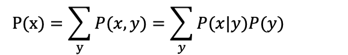

## Generative Adversarial Networks(GAN神经网络)

[TOC]

### 摘要

本文提出了一个新的基于对抗的网络框架，主要包含两个模型。一个是生成模型G，用于获取整个数据分布；另一个是判别模型D，用于判别数据是来自真实数据还是生成数据。生成模型尽可能让判别模型犯错。判别模型试图找到一个函数，使得判别模型在真实的数据上得分较高，在生成模型的数据上得分较低。

### 介绍

GAN网络由两个模型组成：生成模型G和判别模型D。生成模型G的目标是生成尽可能接近真实数据的数据，判别模型D的目标是判别数据是来自真实数据还是生成数据。

生成模型G通过一个随机过程生成数据，判别模型D试图判别数据是否来自真实数据。判别模型D有一个输出值，表示数据来自真实数据的概率。判别模型D有一个目标函数，使得判别模型在真实的数据上得分较高，在生成模型的数据上得分较低。

生成模型G有一个目标函数，使得判别模型在生成模型的数据上得分较低，在真实的数据上得分较高。

生成模型G和判别模型D交替更新，生成模型G的目标函数和判别模型D的目标函数相互对抗。

### 方法

GAN网络可以应用在图像生成、语音生成等领域。

### 参考资料

[1] Ian Goodfellow, Jean Pouget-Abadie, Mehdi Mirza, Bharath Ramsundar, Tomaso Poggio. Generative Adversarial Nets. 2014.